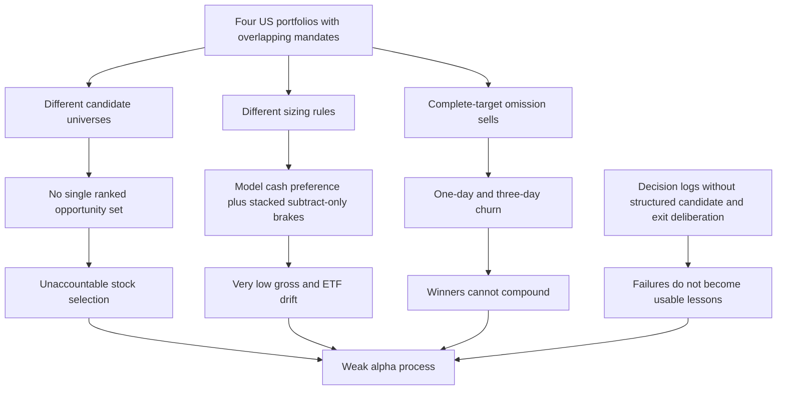
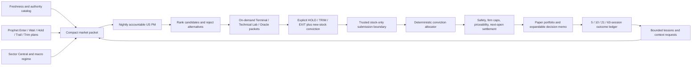

# US Board Audit and Mastermind Portfolio v2

**Date:** 2026-08-08

**Scope:** Flagship, Heavyweight, US Brain, ETF Brain, CN Brain, HK Brain, the Portfolio improvement loop, and their Macro Dashboard / Terminal data seams

**Operating boundary:** paper-only. The language model researches and proposes; trusted deterministic code owns eligibility, sizing, settlement, and all portfolio-state mutation.

## Executive verdict

The underperformance is not one mysterious model failure. The US product was four portfolios with four different definitions of an idea, four allocation policies, and several incompatible sell semantics. No single portfolio manager was accountable for the whole path from candidate discovery to entry timing, position size, holding discipline, exit, and post-exit review.

Flagship was the most structurally broken. Its broad deterministic funnel generated a very large candidate population, then stacked research, timing, safety, and firm-risk brakes on top. The result was simultaneously high churn and very low gross exposure. Its language-model layer generally adjudicated names already selected by the mechanism; it was not an accountable allocator choosing the best US opportunities from Prophet and sector intelligence. Contrary to the intuitive diagnosis, the pre-redesign Flagship was not simply a Prophet portfolio: Prophet appeared as per-name context where available, but it was not the primary, intelligent portfolio-construction loop. That distinction explains why its trades could look Prophet-driven without the portfolio actually exploiting Prophet coherently.

Heavyweight inherited the US system's ideas and then concentrated them. It could not repair bad upstream selection, and its full-target-book semantics created another churn surface. ETF Brain was a separate asset-allocation mandate that did not justify its token and operational cost. The old US Brain at least had one accountable language model, but it allowed both stocks and ETFs, rewarded cash, gave the model raw weight authority, and interpreted omission from a new target as a sale. It therefore drifted toward cash and index products instead of acting as a stock-alpha portfolio.

CN and HK worked better because their practical loop was simpler: narrow venue, localized currency and benchmark, a corroborated regional candidate funnel, explicit priceability checks, feed-health defenses, and one language model responsible for the daily target. They are not flawless—the pre-v2 regional submit path also treated omission as a sell and permitted excessive cash—but they provide the correct starting architecture.

The resulting decision is:

1. Archive Flagship, Heavyweight, and ETF Brain as read-only historical evidence. Remove their scheduled, retry, settlement, marking, overnight, and direct-run activity so they cannot trade or consume model tokens.
2. Make **US Brain v2** the sole active US stock-selection portfolio and the default dashboard book.
3. Make Prophet a first-class, provenance-labelled discovery and position-management input, not an automatic order generator.
4. Let the language model choose names, conviction, timing, and explicit exits; let a deterministic allocator convert ordinal conviction into bounded weights.
5. Upgrade US, CN, and HK with the same intelligence catalog, structured decision memo, explicit-exit contract, deterministic ordinal sizing, post-sell forward ledger, and bounded lesson memory. Keep the US-only stock gate and early-exit hysteresis market-scoped while regional evidence accumulates.

This redesign is intended to improve decision quality and pursue measurable alpha. It cannot guarantee profits, and it should not be promoted on narrative confidence or a short winning streak.

## Evidence conventions

This report uses four labels:

- **[Production observation]** was read from the running VPS portfolio artifacts, trade histories, run status, or admin API during the 2026-08-07/08 audit.
- **[Code-confirmed]** follows directly from the repository implementation at the audited `origin/master` baseline.
- **[Inference]** is a causal interpretation supported by those observations and mechanics, but is not itself directly measured.
- **[Implemented v2]** describes the redesign in this delivery branch. **[Proposed next]** describes work that should remain behind an evaluation gate.

The production figures below are a point-in-time operational snapshot, not a controlled backtest. Book inception dates, exposure, and benchmark freshness differ, so raw returns should not be treated as a statistically fair horse race.

## What production showed

### Portfolio state snapshot

| Portfolio | Total return | Cash | What the snapshot says |
|---|---:|---:|---|
| Flagship | **-4.416%** (NAV **$955,839.93**) | **~95.17%** | The nominal flagship had almost ceased being an equity portfolio while still generating substantial turnover. |
| Heavyweight | **+0.1294%** | **~74.6%** | Slightly positive, but mostly cash and dependent on the same fragmented US idea supply. |
| US Brain | **-2.1304%** | **~89.5% actual** | The latest target was roughly 60% gross and contained ETFs plus AAPL; it was not behaving as a dedicated stock picker. |
| ETF Brain | **-1.7573%** | **~60.9%** | It lagged its intended use case and duplicated exposure available elsewhere. |
| CN Brain | **+1.4209%** | **~49.4%** | Positive despite substantial cash; benchmark data in the audited snapshot was stale, so relative performance requires refresh before formal grading. |
| HK Brain | **+1.6872%** | **~46.5%** | Positive while the displayed Hang Seng comparison was **-6.3045%** in the snapshot. |

**[Production observation]** The snapshot supports the user's directional concern: the three active-style US stock systems did not deliver a coherent, invested stock-alpha book, while CN and HK had recovered and were holding durable winners. It does not by itself prove that one architecture will outperform in every regime.

### Churn evidence

| Portfolio | Closed trades | Closed in <=1 day | Closed in <=3 days | Interpretation |
|---|---:|---:|---:|---|
| Flagship | 118 | 73 (61.9%) | 93 (78.8%) | A medium/long-term mandate behaving like an unstable daily recomputation. |
| Heavyweight | 45 | 20 (44.4%) | 30 (66.7%) | Concentration did not create holding conviction; it reproduced upstream instability. |
| US Brain | 11 | 0 | Not anomalous in the same way | The primary failure was allocation/cash/instrument drift, not one-day churn. |

**[Production observation]** BIIB was bought and sold the next day for approximately -0.88%; SYK was bought and sold the next day for approximately +0.93%. Those outcomes do not prove that either sale was unknowable in real time. They do prove that the system lacked a credible medium-term holding contract: a next-day reversal needed an explicit hard falsifier and audit trail, neither of which was structurally required.

**[Production observation]** CN/HK records contained winners of roughly 14–16% held for approximately 20–42 days. That is consistent with a process able to let a confirmed winner compound, rather than rebuilding conviction from zero every night.

### Flagship's latest funnel

**[Production observation]** The audited Flagship run showed approximately 278 parked names, 145 candidates, and 143 rejections; only APA and BLK survived the principal funnel. Subsequent firm-risk limits left roughly 4.83% gross and fired a D7 over-degross warning. Neural Web context was stale and contributed zero current candidates.

**[Inference]** This is a selection architecture with the shape of a sieve, not a portfolio manager. Candidate quantity, stacked subtract-only filters, and stale optional planes produced a tiny residual book. The portfolio could churn the few names crossing the threshold while remaining overwhelmingly in cash. More gates did not create better selection because no one layer ranked the opportunity set and accepted end-to-end responsibility.

### Existing “self-improvement” loop

**[Production observation]** The admin-facing loop exposed through the legacy `/api/mastermind_ai` surface showed 17 loops, 217 drafts, 34 pending items, four lessons, zero pins, and no outcome sample (`n=0`). Self-tuning was dark. Neural Web coverage was zero. Six directives had been published and one queued, but Macro acknowledgement was absent for three loops; the agenda contained 28 items and the firm allocator snapshot was stale.

**[Inference]** This was an observational backlog and proposal generator, not a demonstrated closed learning loop. It produced drafts and directives without proving that realized outcomes changed a future portfolio decision. Calling it “Mastermind AI” also conflated it with the unrelated public chatbot.

## How each legacy US board actually worked

### Comparison at a glance

| Board | Candidate source | Who chose names? | Who sized? | Sell path | Core design failure |
|---|---|---|---|---|---|
| Flagship | Broad unified engine funnel: briefing, standouts, radar, alt-data, news, open theses, plus flag-gated rotation/divergence/Neural Web/cycle inputs; Prophet was supplemental per-name context | Deterministic confluence/veto/research/timing pipeline; optional LLM seats could confirm, withhold, or trim survivors | Sleeve budgets and deterministic engine, then multiple subtract-only overlays | Rebuild disappearance below exit floor, hard-veto sweep, D5 time stop, optional risk officer, macro cap, full rebalance | No single accountable PM; huge funnel plus stacked brakes yielded churn and near-zero gross. |
| Heavyweight | Union of published Flagship, US Brain, and ETF holdings, with Flagship mirror fallback | LLM selected only from upstream books; one name per correlated cluster | LLM proposed weights; trusted rails kept about eight names and clamped each to 5–50%, then firm caps | Omission from the complete target sold the held name; otherwise rails could drop it; direct rebalance | An analogue/concentrator cannot repair weak upstream ideas; it multiplied turnover and exposure overlap. |
| US Brain v1 | Current book, regime, broad in-house research tools, and open web; no required ranked intake | One deep LLM with free-form discretion | LLM supplied exact target weights; safety and firm caps could only reduce | Complete target semantics: omitted held name sold; daily book could be entirely recomposed | ETFs permitted, cash explicitly rewarded, no required Prophet funnel, no explicit-exit contract, no timing/holding hysteresis. |
| ETF Brain | Static US ETF allowlist plus an ETF rotation board, macro regime, sector relative strength, and risk state | One deep LLM inside the allowlist | LLM proposed weights; max-name, turnover, crisis-offensive, overextension, factor-cluster, and firm caps adjusted them | Omitted ETF was fully sold; the turnover throttle expressly did not protect omissions | A separate mandate duplicated beta/sector exposure, consumed a model seat, and did not beat its relevant alternatives. |

### Flagship: deterministic breadth without portfolio judgment

**[Code-confirmed]** The legacy run was material-change gated. On an immaterial day it carried the prior book, except that a held conviction name could still be swept out by a hard veto/downtrend. On a material day it rebuilt leadership, conviction, and defensive sleeves; created a broad candidate set; applied confluence and hard vetoes; generated/re-digested research papers; optionally invoked committee/gate/PM seats; applied entry timing withholds; then sized the surviving book.

The principal intake path came from `brain/intake.py`, not from a single Prophet list. The pre-redesign simple sources were briefing-derived standouts, radar, alternative data, news surges, and open theses; rotation-in, divergence, Neural Web, and cycle-bottoming sources were conditional. Prophet geometry could be inserted into a research paper or entry review, but there was no accountable nightly allocator required to start at Prophet, compare its plans, and explain why one plan beat another.

**[Code-confirmed]** Flagship's sells could arise from several mechanisms:

- a hard veto or price downtrend, including a sweep even when the material-change gate stayed closed;
- failure to remain in the rebuilt target after held-name hysteresis;
- a D5 dead-capital time stop when the thesis clock expired and the name was flat/negative and lagging;
- an optional risk-officer exit/trim or macro-risk cap;
- a target weight reduced to zero by rebuilding and the final rebalance;
- subtract-only safety and firm-exposure overlays that reduced gross and converted the difference to cash.

**[Inference]** These are individually defensible controls. Their composition was not. Because different layers originated, validated, sized, and removed positions, the daily log could describe a final state without one actor explaining why the expected upside still outweighed the opportunity cost and why the holding horizon changed overnight. SYK/BIIB-style churn was therefore a predictable property, not an isolated bug.

### Heavyweight: derivative conviction

**[Code-confirmed]** Heavyweight read the union of positions/pending names published by Flagship, US Brain, and ETF Brain (excluding the self-directed book). If the union was too thin, it fell back to a Flagship mirror. The model selected from this inherited universe, after which deterministic code kept one name per fragility cluster, dropped sub-5% nibbles, clamped weights to 5–50%, retained roughly the top eight, and applied firm exposure limits.

**[Code-confirmed]** Its submission was a complete target. A held ticker omitted by the model was sold on rebalance. If the entire submission was stripped by the rails, code carried the prior book instead of liquidating everything. Otherwise, there was no medium-term thesis lock or explicit reason required for an ordinary next-day omission.

**[Code-confirmed defect]** Conviction was represented as strings (`high`, `medium`, `low`) while one enforcement rank attempted numeric conversion; nonnumeric values fell to zero, weakening the intended conviction ordering. The legacy decision log also described submitted/kept weights before every downstream clamp, making the apparent decision diverge from final exposure.

**[Inference]** Heavyweight was redundant by construction. When the upstream boards disagreed or churned, it received a moving union. When they agreed, it amplified correlated firm exposure. There was no independent informational edge to justify a separate scheduled model seat.

### US Brain v1: accountable model, wrong mandate

**[Code-confirmed]** US Brain v1 ran once after the US close. It saw its current holdings and regime, could explore broad typed dashboard tools or the web, and submitted a complete target portfolio. It had no research-paper or portfolio committee gate. The model chose exact weights, subject only to no leverage; safety and firm-exposure layers could reduce the target. Off-hours decisions were queued for the next open.

Its prompt explicitly allowed **US-listed equities and ETFs** and said idle cash earned about 4%, making cash a rewarded choice. It did not require Prophet to be the intake spine, did not require a structured comparison of finalists and rejects, and said anything omitted from today's target would be sold.

**[Inference]** Given that objective, moving toward ETFs and cash was not weird model behavior; it was a locally rational response to the prompt. The mandate asked a general asset allocator to protect capital, then expected a stock picker to produce alpha. The v2 mandate must resolve that contradiction in code as well as prose.

### ETF Brain: disciplined but unnecessary

**[Code-confirmed]** ETF Brain had more trusted discipline than US Brain v1: an ETF-only allowlist; an ETF rotation board; maximum single-ETF exposure; small-change turnover throttling; crisis caps on offensive gross; overextension and factor-cluster controls; and firm-wide exposure limits. It queued off-hours targets for the next open.

**[Code-confirmed]** It still used complete-target semantics. An omitted ETF was liquidated; the turnover throttle only snapped small changes for names still present and expressly did not protect omitted names.

**[Inference]** The issue was not an absence of engineering. The strategy was an additional beta/sector allocation layer without demonstrated incremental edge, while US Brain could already hold ETFs and the user maintained a self-directed ETF portfolio. Archival removes duplicated objectives and token spend.

## Why CN and HK worked better

### Shared mechanics worth copying

**[Code-confirmed]** Each regional book had one deep model responsible for the whole daily target, a hard venue boundary, native currency accounting, a local benchmark, priceability checks, and market-hours-aware execution/queueing. A failed or asymmetric fresh-price map could stop the Brain rather than let stale holdings appear priceable while fresh candidates disappeared.

The China intake merged several independent regional desks into one provenance-bearing queue:

- A-share buy-board standouts;
- residual-alpha leaders;
- oversold/reversal candidates;
- the HK standouts board;
- a China macro/liquidity frame.

Corroboration across independent sources lifted a name. “Good company, bad entry” conditions reduced its score and removed an immediate buy lean. The book then enforced its own venue: CN accepted only `.SS`/`.SZ`; HK accepted only `.HK`. The model could examine a compact ranked queue, fetch deeper evidence and quotes for finalists, and submit one coherent local book.

**[Inference]** The performance difference is consistent with four architectural advantages:

1. **Smaller decision surface.** A venue-specific ranked funnel focuses research instead of asking the model to rediscover the market.
2. **Corroboration before model attention.** Multiple regional desks do useful filtering while preserving provenance.
3. **One accountable allocator.** The same nightly manager sees the current book, chooses entrants, and decides what remains.
4. **Market isolation.** Local tickers, currencies, benchmarks, and microstructure prevent irrelevant US assumptions from contaminating the choice.

### What must not be copied blindly

CN/HK success does not make their v1 mechanics perfect.

- **[Code-confirmed]** Their old complete-target contract also treated omission as a sale. The v2 explicit-exit boundary should be shared.
- **[Production observation]** Both still held roughly half the book in cash. Their prompts also described cash as rewarded, which can make “no” easier than comparative opportunity selection.
- **[Code-confirmed]** The HK book consumes a China macro frame; a richer HK-specific liquidity, index, southbound-flow, property, and peg/rates frame remains desirable.
- **[Known operational risk]** Exchange calendars, holidays, price locking, limit-up/limit-down behavior, and true-open settlement require venue-specific validation.
- **[Production observation]** CN benchmark freshness was insufficient for a conclusive relative-return grade in the audited snapshot.

The migration rule is therefore: copy the regional architecture, not every current parameter.

## Root-cause map

The root causes are:

1. **Mandate fragmentation.** “Flagship,” “free-form,” “concentrated,” and “ETF rotation” optimized different things while being judged as one US capability.
2. **No authoritative selection owner.** Flagship's engine and LLM seats divided responsibility; Heavyweight inherited; US v1 had freedom but no required funnel.
3. **Dangerous sell semantics.** An omitted JSON row meant liquidate, so truncation, distraction, or a changing shortlist became trade authority.
4. **Cash-positive prompting plus multiplicative de-grossing.** Models were praised for inactivity while safety layers could only subtract. No layer owned a sensible final gross target.
5. **Timing disconnected from thesis.** Technical evidence could gate entry, but there was no shared holding-state machine that distinguished noise, trim, trend break, and thesis failure.
6. **No post-sell counterfactual.** The system recorded a sale but did not consistently ask what the stock did 5, 10, 21, and 63 sessions later relative to the local benchmark.
7. **Token-inefficient context access.** Many rich pages existed, but the model lacked a compact catalog and staged retrieval path; it either searched broadly or ignored useful planes.
8. **Observability mistaken for learning.** Drafts, agendas, and proposed directives accumulated without a measured outcome-to-future-prompt loop.
9. **Naming and authority ambiguity.** A private portfolio-improvement route was called Mastermind AI, the same product name as the public chatbot; some evidence planes also lacked a clearly visible context-only boundary.

## Consolidation and archive contract

### Operational decision

**[Implemented v2]** `portfolio/registry.py` retains `flagship` as the legacy **storage** default so historical paths remain compatible, but makes `autonomous` / US Brain the **dashboard** default. Flagship, Heavyweight, and ETF Brain have `active: false`, `status: archived`, and `superseded_by: autonomous` metadata.

Archive means more than hiding a tab:

- no scheduled daily, retry, first-run, overnight, de-risk, marking, or settlement work;
- no model call and therefore no token spend;
- manual run endpoints return a retired/HTTP 410 response;
- direct Python entry points return before feed reads, model calls, or portfolio writes;
- direct embedded/stdin MCP submit surfaces fail closed and archived command-line runners exit cleanly without work;
- archived books are excluded from active firm-exposure math;
- their persisted NAV, positions, trades, and historical decisions remain visible and immutable for audit. Archived API reads do not fetch quotes, revalue positions, recompute risk, or write caches, so a frozen headline cannot drift away from its frozen chart.

The archive must **not** synthesize a liquidation. Historical/pending state is frozen rather than converted into new fills. Any eventual close-out or deletion is a separate, explicit operator action.

**[Implemented v2 cutover]** The pre-v2 US Brain left an unversioned, ETF-heavy pending target on the production VPS. New autonomous targets therefore carry an explicit `pending_target.v2` / `us_brain_v2` contract. At process startup the scheduler remains paused while that queue is validated. A legacy, malformed, or mismatched file is atomically moved to a recoverable quarantine with a hard-stop audit event before any settlement, overnight refinement, de-risk rewrite, price read, or model call. A failed quarantine prevents the scheduler from resuming; current holdings are never automatically liquidated.

The old weekly CIO artifact remains available for deterministic historical/regional reporting, but unattended narration over Flagship's retired seats is disabled. This preserves required lifecycle snapshots without spending Opus tokens on a dead architecture.

### Why one active US board, not two

One board is the clean baseline because stock selection, allocation, and exits need one accountable owner. A second board should exist only if a future shadow experiment demonstrates an independent edge with a distinct objective and no duplicated firm exposure. “More model opinions” is not sufficient evidence.

## US Brain v2 design

### End-to-end flow

### Candidate discovery: Prophet is the spine, not the boss

**[Implemented v2]** US Brain receives a typed Prophet board that separates:

- **discovery:** active `Enter` and `Wait` plans, ranked by conviction and age;
- **management:** `Hold`, `Trail`, and `Trim` plans plus plans matching current holdings;
- **coverage gaps:** held names without an active plan;
- **geometry:** entry, trigger, invalidation, targets, risk, and reward-to-first-target;
- **provenance/health:** artifact, date, age, authority tier, and context-only status.

Prophet also joins the broad US intake as a provenance-labelled candidate source. This uses the filtering Prophet has already done without turning its output directly into weight or an order. The PM must compare Prophet names with sector leadership, current holdings, and qualified non-Prophet opportunities; it must record why finalists won and meaningful alternatives lost.

The book is **stock-only**. Trusted normalization rejects known ETFs even if the model submits one. An ETF may be used as sector/benchmark evidence but cannot become a US Brain holding.

### Efficient intelligence access

**[Implemented v2]** The daily model does not need arbitrary access to the VPS or a raw repository search. It gets a bounded, read-only catalog of published contracts and a three-step retrieval budget:

1. **Start cheap:** one market packet with current book, canonical regime, top sector rotation, top Prophet discovery/management rows, data-health summary, and measured portfolio lessons.
2. **Shortlist:** query the Prophet and sector packets at bounded limits; use existing research tools for fundamentals, themes, news, options, and other finalist checks.
3. **Deepen only finalists and held-name reviews:** fetch a per-ticker technical packet containing spot trend, entry assessment, Terminal signals, daily/3-day/weekly/monthly MACD and Stoch-RSI fields, Golden Oracle contracts/state, Prophet plan geometry, GEX, and options flow.

This “packet first, drill down second” design makes the common nightly path token-efficient while retaining typed access to the full relevant artifact when a decision needs it. Missing, stale, malformed, and undated data are surfaced rather than silently treated as current.

The catalog maps the requested product surfaces to explicit artifacts:

| Surface | Portfolio use | Authority |
|---|---|---|
| [Sector Central](https://www.mastermind-x.com/sector_central.html#) | sector/basket rotation, breadth, cycle and conviction | Context |
| [Intelligence Hub](https://www.mastermind-x.com/intelligence_hub.html) | narrative and event research | Context |
| [Foresight](https://www.mastermind-x.com/foresight.html) | catalyst/cascade hypotheses | Context |
| [Radar](https://www.mastermind-x.com/radar.html) | discovery and corroboration | Context |
| [State of Themes](https://www.mastermind-x.com/state_of_themes.html) | theme leadership/crowding | Context/display |
| [ETFs](https://www.mastermind-x.com/etfs.html) | sector/fund-flow evidence only for the US stock book | Context/display |
| [Macro Context](https://www.mastermind-x.com/macro_context.html) | top-down risk and liquidity | Context |
| [Movers](https://www.mastermind-x.com/movers.html) | change detection and candidate discovery | Context/display |
| [Intraday Flow](https://www.mastermind-x.com/intraday_flow.html) | timing/confirmation with intraday freshness limits | Display/context, never direct order authority |
| [Options](https://www.mastermind-x.com/options.html) | GEX, skew, positioning and risk levels | Display/context |
| [Confluence Screener](https://www.mastermind-x.com/confluence_screener.html) | cross-signal candidate validation | Context |
| [Stock Seasonality](https://www.mastermind-x.com/stock_seasonality.html) | secondary timing/context | Context |
| Prophet | stock discovery, plan geometry and held-name management | Display/context |
| Neural Web | portfolio context and relationship evidence | Shadow/context until separately promoted |
| Golden Oracle / Technical Lab / Terminal | multi-timeframe entry, trend, trail and exit evidence | Reference/display/context |

Generic filesystem access is intentionally absent. Giving a nightly model unrestricted VPS and repository access would enlarge the prompt surface, leak irrelevant operational state, weaken provenance, and turn a research agent into an infrastructure mutation risk. If a typed plane is missing, the model can submit a bounded context-upgrade request with the affected ticker and decision-relevant reason.

### Selection, sizing, and cash

**[Implemented v2]** The PM selects securities and supplies ordinal conviction (`high`, `medium`, `low`), rationale, why-now, falsifier, evidence, source provenance, expected horizon, and exit plan. Its proposed numeric weight is retained for audit but is advisory.

The trusted US pilot allocator maps conviction scores 3:2:1 into a posture-dependent target gross:

| Risk posture | Target gross | Purpose |
|---|---:|---|
| Normal | 80% | Default stock-alpha posture; enough gross to make selection matter. |
| Caution | 60% | Meaningful participation with measured risk reduction. |
| Crash | 25% | Preserve optionality during a verified crash or degraded evidence environment. |

No single name can exceed 15% before downstream risk controls. Carried positions consume gross before new ideas are allocated. No leverage is permitted. If gross is below 60%, the submission visibly requires a cash rationale, including what investable candidates were examined and rejected.

This is a target, not a forced-buy quota. A model should not fabricate marginal names to reach 80%; it must instead make opportunity cost observable. Conversely, “cash is rewarded” has been removed as the default answer. Normal conditions require an affirmative comparison of Prophet leaders, sector leaders, defensives, and current winners before accepting a low-gross book.

### Entry and sell discipline

**[Implemented v2]** A complete target is no longer allowed to turn silence into a trade:

- every current holding remains represented after normalization as a hold, trim, exit, or quarantine; the prompt asks for a fresh review and the audit exposes any omission;
- omission alone never sells; an omitted position is carried forward;
- a full sale requires an explicit exit record with reason, reason code, evidence, and why-now;
- for positions held three days or less, an exit is blocked unless the code is a hard falsifier, technical break, material thesis change, risk limit, fraud/delisting, or stop breach;
- a trim is expressed as `light`, `standard`, or `deep`; trusted code retains 80%, 60%, or 35% of the lower of actual and prior-target weight, and missing evidence fails closed to HOLD;
- trend and thesis intact favors hold or trim-and-trail over reflexive liquidation;
- downstream priceability, safety de-gross, firm exposure, and next-open settlement remain trusted controls.
- a late quote outage cannot turn an intended hold into an omitted-name sale: held rows remain in the target, and the account boundary refuses any explicit/omission exit whose held ticker lacks a positive market price before mutating state.
- a newer open-session PM target atomically supersedes any older queued target and is settled exactly once; the engine never executes stale intent first and then round-trips back to the new book.

This does not prohibit fast risk control. It prohibits an unexplained fast reversal. A true technical break or falsifier can still exit immediately.

### Executable-target validation and price completeness

**[Implemented v2]** The normalized executable target—not an unchecked language-model payload—is one atomic instruction. The paper-account boundary rejects a non-object target; malformed or non-canonical tickers; canonical ticker collisions; booleans or numeric strings; NaN/infinite, negative, or above-100% weights; and total gross above 100%. Zero-weight rows carry no executable intent and are removed. The same validator runs when a target is queued, loaded, preflighted, settled, and rebalanced, closing the common “validated at the API but not at execution” gap.

Price completeness is also defined over the **whole normalized target**, not only its sells. Before a rebalance can mutate an account, trusted prices must exist for every positive target row—new or held—and every currently held row that the target intends to close. A proposed addition may be rejected upstream as unpriceable and surfaced in the audit, but once the executable target is formed it cannot be partially filled. If any required price is missing, the entire instruction stops before an account write, an open queue remains available for retry, and the system records whether the gap affected an intended exit or positive target. A second boundary check inside settlement protects against quote loss or target replacement between preflight and mutation.

### Queued-decision provenance, latest intent, and crash recovery

**[Implemented v2]** Every active Brain queue carries the accepted structured PM submission inside the same atomically replaced `pending_target` artifact. A `pending_decision.v1` envelope binds that decision to the exact canonical target with a SHA-256 digest, portfolio identity, and accepted date. If a deterministic de-risk pass changes the numeric target, it rebinds the digest and appends bounded lineage without rewriting the original rationale. A malformed, cross-book, or digest-mismatched decision/target pair fails preflight and is quarantined rather than executed. Clearing the model's mutable scratch submission can therefore no longer erase or replace the rationale that belongs to a next-open fill.

“Latest decision wins” is enforced before execution. An open-session PM run atomically persists its current target over any older queue and settles that one target once; it does not fill stale overnight intent and then rebalance back to the new book. If the newest target is temporarily unpriceable, that newest target replaces the stale queue as the retry instruction. If replacement itself fails, the superseded queue is recoverably quarantined so it cannot execute later. Transaction completion clears only the exact queue hash it consumed, leaving any concurrently newer target intact.

Account state, fills, and queue consumption are protected by a per-book write-ahead transaction. Account replay accepts only the recorded before or exact after state; deterministic fill IDs make an interrupted append idempotent. For queued settlements, recovery writes a durable settlement receipt/outbox containing the target, bound decision snapshot, fills, and before/after positions **before** clearing the consumed queue and deleting the WAL. That receipt remains until position-log projection, NAV marking, and rationale-bearing publication all succeed, after which it is explicitly acknowledged. A restart can finish those projections without replaying a fill, and a new PM intent is refused while an unfinalized receipt remains. This closes the failure mode where account/fills committed but the public book and decision memo silently disappeared.

### Detailed decision log without opaque chain-of-thought

**[Implemented v2]** Each daily entry has a compact summary plus an expandable structured memo. The memo records:

- market and regime frame;
- initial candidate funnel and provenance;
- selected names and why-now;
- important rejected alternatives and why they lost;
- changes to every existing holding;
- timing and technical evidence;
- risk/cash deliberation and expected failure mode;
- falsifiers, liquidity notes, and source provenance;
- lessons applied from prior trades;
- context gaps and any requested data upgrade;
- a summary of delegated research and tools used;
- explicit exits and submission/allocator audit fields.

Each row separately records the proposed target and its execution status. Only an accepted
`executed` or `queued` target becomes the durable prior-target anchor for a later trim. A rejected,
packet-blocked, or quote-frozen submission remains useful audit evidence but cannot masquerade as a
portfolio change or compound into a second trim on the next run.

For next-open execution, publication uses the hash-bound accepted submission carried by the queue/receipt, never whichever scratch submission happens to exist when settlement runs. This preserves the selected/rejected rationale and detailed memo across process restarts and later Brain sessions.

The UI renders that structure behind an expand control. It deliberately does not publish hidden token-by-token chain-of-thought. Structured evidence, alternatives, rules, and conclusions are more auditable, safer to store, and easier to grade than an unconstrained reasoning transcript.

## Three-brain intelligence and meta-learning plane

### Shared substrate, local judgment

US, CN, and HK should share contracts for:

- data-plane health and provenance;
- structured decision memos;
- explicit exits;
- outcome horizons and benchmark-relative grading;
- bounded context requests;
- universal execution/risk lessons after cross-market validation.

They must **not** share market-specific candidate ranks or microstructure rules. A US options-flow pattern is not an A-share signal; an A-share limit-up behavior is not an HK exit rule; southbound-flow or HKD-peg dynamics do not belong in the US model. Each lesson therefore carries a market scope and a shareability class.

### Incremental changes to CN and HK

**[Implemented v2]** CN and HK gain the shared v2 governance schema, structured memo, explicit-exit boundary, expandable logs, measured meta-memory, and deterministic ordinal sizing. They keep their successful candidate funnels, venue gates, local currency, and benchmarks. Model numeric weights are advisory in all three markets: the regional allocator maps high/medium/low conviction to 18%/12%/6% caps and uses posture gross targets of 85%/65%/30%, while preserving carried holdings exactly and never inventing marginal names merely to fill gross. CN/HK do **not** inherit the US three-session early-exit hysteresis without local evidence.

Their prompts now make the dual objective explicit: preserve capital **and** seek positive local-market alpha. High cash needs a market-data explanation and rejected-opportunity record. Winners in strong sectors should be held while their thesis/trend remains intact; a weakening sector or technical break should trigger a deliberate trim/exit review.

### Post-sell forward ledger

**[Implemented v2]** After each recorded sale, the learning layer measures the stock at 5, 10, 21, and 63 trading sessions against that portfolio's local benchmark. Absolute opportunity cost uses the immutable paper fill. Relative grading uses one benchmark-defined pair of market sessions and exact same-session close-to-close marks for both stock and benchmark, so an open fill is never compared with an unrelated benchmark close and suspended/missing stock bars are not silently shifted to another date. Every historical rerun is capped at its declared as-of date. A partial trim remains distinct from a true full exit, and premature-exit lessons train only on full exits. The record distinguishes:

- what was knowable and documented at sale time;
- the stock's absolute forward return;
- the benchmark's forward return;
- relative post-sale performance;
- whether the horizon has matured or remains pending.

A sale can be procedurally correct even if the stock later rises; a lucky sale can still be poorly reasoned. The review therefore grades both process and outcome. Repeated strong relative returns after sale are evidence of premature exits; repeated large negative post-sale returns can validate a cut discipline.

### Bounded lessons, not autonomous code mutation

**[Implemented v2]** The learning layer derives compact behavioral lessons from measured history, including excessive <=3-day churn, recurring premature exits, and unexplained high cash. These lessons are injected into the next session as advisory meta-memory rather than raw logs.

A supposedly universal lesson is shared only after the same rule recurs in at least two independent books. Market-specific lessons stay local. The model can request a new typed context plane, but cannot grant itself filesystem, execution, sizing, or deployment authority.

“Self-improving” therefore means:

1. observe a decision with reproducible evidence;
2. measure its forward outcome;
3. derive a bounded, falsifiable lesson;
4. inject the lesson into future deliberation;
5. request a missing data plane when the evidence shows a recurring gap;
6. promote code/config changes only through tests, shadow evaluation, review, and deployment controls.

It does **not** mean allowing a portfolio model to rewrite and deploy its own trading code. Unreviewed self-modification would make attribution impossible precisely when the system needs to learn why it failed.

The implemented improvement tick is deterministic and observational: it advances outcome ledgers, derives bounded lessons, reconciles acknowledgements, and transports typed requests without granting a tool or changing the trading policy. An optional language-model review is separately double-gated, receives only bounded deterministic counts, has an empty tool list, and can add at most screened explanatory prose. It cannot edit code/configuration, change a prompt on disk, resize a book, or turn a request into infrastructure. Any real method change still requires a versioned experiment and the normal repository, test, review, merge, and deployment path.

### Portfolio improvement loop and Neural Web requests

The legacy `/api/mastermind_ai` compatibility route is labelled **Mastermind Portfolio Improvement Loop** in its payloads; the external admin shell should consume that label instead of conflating it with the public chatbot. It aggregates decisions, outcomes, lessons, directives, and context requests, but a loop is not successful because it emitted a draft. Success requires an acknowledged, versioned change and a measurable future decision effect.

**[Implemented v2]** A portfolio context request now enters its own bounded transport/review lane on every improvement cycle, independent of the global Neural Web `auto_act_on_findings` switch. It carries explicit `untrusted_pm_generated`, `request_only`, and no-sizing/no-execution authority labels, plus a collision-resistant ID and transitions for queued review, directive queued, published, acknowledged, expired, resolved, or rejected. Existing safe Neural Web nudges remain separately gated. A request can ask for a typed plane; it cannot expose a file, grant a tool, change authority, edit code, or trade. Macro acknowledgement is mirrored back onto the originating request, and interrupted two-ledger transitions are reconciled idempotently rather than reported as successful after a failed write.

Acknowledgement proves only that the orchestrator received the bounded request. It is not evidence that a new plane was built, that its authority changed, or that a later decision improved; those require separate versioned delivery and outcome evidence.

Every request should have:

- requesting book and market scope;
- typed plane identifier and optional ticker;
- the exact decision gap it would resolve;
- freshness/authority required;
- owner and acknowledgement state;
- shadow evaluation plan;
- promotion or rejection result.

Neural Web remains context/shadow authority unless separately promoted with evidence. Identity, relationship, or narrative context must not silently become candidacy or sizing authority.

## Mastermind Portfolio versus public Mastermind AI

The names refer to different products:

| Product | Audience | Authority | State |
|---|---|---|---|
| **Mastermind Portfolio** | Internal/operator portfolio system | Paper proposals through trusted sizing/settlement | US, CN, HK daily books; learning loop; historical archived books |
| **Mastermind AI** | Frontend user chatbot | Advice/conversation only | Public chat product; no private paper-account mutation |

**[Implemented v2]** Portfolio API responses carry a `product_scope`/portfolio label, dashboard copy says Mastermind Portfolio, and archived book metadata is explicit. The private advisor now queues a strict, size-free, content-idempotent action proposal and cannot import or call paper-account mutation paths. The active US PM receives a bounded snapshot of pending proposals; only after the trusted target is accepted as `queued` or `executed` does that exact presented snapshot transition once to `selected` or `not_selected`, always with `executed: false`. A rejected/no-submission, packet-blocked, quote-frozen, or failed-settlement turn leaves those proposals pending for a future PM. Malformed or foreign records are recoverably quarantined, and the retired untyped recommendation tool is absent from the advisor surface. The legacy route name remains for compatibility but must not be used as the product label.

The private portfolio advisor must also remain proposal-only. A chat response may suggest a hypothetical action, but it must not mutate a paper account or model weight directly. Any future user-authorized portfolio change should pass through the same typed proposal, deterministic sizing, and execution boundary as the nightly book.

## Model and subagent operating model

The authoritative daily PM is Codex `gpt-5.6-sol` at `xhigh` through the shared Macro provider waterfall. Claude OAuth capacity remains a quota/auth fallback: Opus for deep/PM work, Sonnet for analyst work, and Haiku for scouting. Provider success, cooling, and quota state belong in the shared Macro ledger; the Portfolio must not create a credential island.

**[Implemented v2]** Project-local agent roles define:

- a signal scout for bounded extraction and freshness checks;
- a narrative analyst for a sector or stock thesis;
- a quant/code analyst for read-only calculation or contract inspection;
- a deep reasoner for the hardest portfolio synthesis.

**[Implemented v2 — Codex primary]** The root nightly PM remains accountable, but Codex delegation is split into two authority phases rather than relying on child instructions:

1. A persisted **research phase** validates the Mastermind project root, active book, exact expected caller MCP servers, and all project agent profiles. The caller's submit/context-request servers are then removed. Parent and children receive one fixed, book-selected `research` MCP containing only audited read tools for US, CN, or HK; raw filesystem/shell, network/web, apps, plugins, arbitrary caller/user MCPs, and portfolio writes are absent. Concurrency is capped at three children, including overrides for Codex's built-in default/explorer/worker roles.
2. The resulting research artifact is treated as untrusted evidence by a separate, ephemeral, agent-disabled **sealed submission phase**. Only this root phase receives the original book-scoped MCP surface. It must call the correct `submit_book` exactly once; zero or multiple submit calls fail the reasoning result. Children can therefore fan out finalist checks or an independent bear case, but cannot submit, size, request infrastructure, or mutate a book.

Every Codex invocation ignores user-level configuration while retaining shared authentication and reconstructing its MCP allow-list per call. Prompt-only reviews run from an empty temporary directory with no MCP or network. Typed portfolio turns disable raw shell/filesystem, native web, apps, plugins, and ambient user MCPs. Bounded read-vendor credentials needed by quote/macro readers are copied only into an owner-readable temporary bundle with a fixed key allow-list; credential **values** never enter model argv, model environment, or logs. The trusted local MCP adapter consumes that bundle, and it is removed when the turn ends.

**[Implemented v2 — Claude fallback safety]** The checked-in Claude agent profiles are typed-read-only and the Agent SDK loads reviewed project settings only, never user/local settings. However, the current Claude bridge cannot runtime-verify the effective MCP inventory inherited by a child. It therefore strips the `Task` capability and runs the fallback as one root PM with the explicit book-scoped surface. The Claude profiles are staged policy and defense-in-depth, not a claim that fallback subagents are currently dispatched. Claude delegation should be enabled only after an equivalent runtime-verifiable child inventory, read-only research transport, sealed-submit boundary, and real canary exist.

The PM should delegate only when parallel work materially reduces context, not as a ritual on every run. Run provenance must state the provider, research tools, and whether delegation actually occurred; configured capability is not evidence that a given session used it.

The checked-in backend and code-level configuration fallback are both `waterfall`, and backend modes are exclusive: an unavailable shared waterfall fails closed instead of silently using a direct Anthropic API key. The pre-delivery production audit observed the shared `CODEX_HOME` and waterfall policy in the service environment, but this report does not treat a code branch or that earlier observation as proof of the rebuilt runtime. Exact-commit deployment and post-restart health verification remain required.

### Scheduler and release liveness

**[Implemented v2]** Scheduled active-book builds, next-open settlements, overnight refinements, de-risk rewrites, and daily marks acquire the same per-book advisory lock before touching state. Multi-book Asia jobs acquire CN then HK in a fixed order and release both on every path. A held lock produces an explicit skipped-run event instead of concurrent account/queue mutation. The scheduler starts paused, removes retired persisted jobs, completes the US legacy-target preflight, and resumes only on a safe result.

A non-serve-only application now fails startup if APScheduler cannot start. `/health` publishes whether a scheduled runtime is expected, whether the scheduler is running, and the combined `scheduled_runtime_ok` result; a serve-only mirror explicitly reports that no scheduler is expected. It also publishes the effective non-secret reasoning backend/policy and exact release commit from the deployment attestation marker.

**[Implemented v2]** Deployment is transactional over the bounded release paths. After taking the previous-release backup, a partial rsync, attestation-marker failure, service-restart failure, reasoning-policy/SHA mismatch, scheduler-health failure, or health timeout all enter the same rollback path. Rollback restores or removes each bounded path according to the backup, restores the prior release marker, restarts the prior service, and probes its health. A new release is accepted only when health attests `reasoning_policy_ok=true`, `scheduled_runtime_ok=true`, and the exact expected merged commit. These are implemented release gates; successful live behavior must still be verified after the actual merge and deployment.

## Continual monitoring: proposed next, not silently implied

**[Known gap]** The current portfolio manager is primarily nightly. A prompt saying it can “continually track” a winner does not create live monitoring.

**[Proposed next]** Add a deterministic, token-light intraday holding sentinel that reads fresh Terminal/technical contracts and emits a reconsideration event only on material conditions:

- confirmed trail-stop breach across the configured timeframe;
- weekly/daily trend disagreement that crosses a tested threshold;
- sector leadership deterioration plus name-level relative-strength break;
- Prophet invalidation or management-state change;
- abnormal gap/liquidity/volatility event;
- feed staleness or contradictory price maps.

The event should first enter shadow mode. Only after acceptable false-positive and latency evidence should it trigger an additional read-only PM review. Even then, the review submits a proposal through the ordinary explicit-exit/allocator/settlement boundary. A noisy intraday detector must never recreate Flagship's churn under a new name.

## Rollout and promotion plan

### Phase 0 — archive and contract verification

Before any v2 performance judgment:

- prove the three archived books have no scheduler, retry, first-run, settlement, mark, overnight, de-risk, or direct-run token activity;
- prove historical files remain readable and unchanged;
- prove the default dashboard/API book is US Brain;
- prove Portfolio/public-AI labels and authority are distinct;
- prove all submit tools are proposal-only and no advisor route directly mutates an account;
- prove malformed, missing, or stale intelligence artifacts fail soft and expose health;
- prove archived reads are local, frozen, and write-free: no quote fetch, revaluation, risk recompute, or cache mutation;
- prove legacy/malformed/mismatched US pending targets quarantine before the scheduler resumes and never synthesize a liquidation;
- prove canonical target validation and whole-target price completeness stop before all account/fill/queue mutation;
- prove the scheduled runtime, shared book locks, reasoning policy, and exact release commit are visible in health/release evidence.

### Phase 1 — replay and shadow evaluation

Replay stored sessions/trade histories through the v2 normalization boundary without changing historical state. Evaluate:

- how many old sells would have been blocked as omissions;
- how many <=3-day exits had a qualifying hard reason;
- whether ETFs were submitted to a stock-alpha book;
- allocator exposure under normal/caution/crash postures;
- decision-memo completeness and token cost;
- Prophet/sector finalist coverage and rejected-alternative quality;
- post-sell relative return of old exits;
- queued decision/target digest mismatches and cross-book snapshots;
- interrupted account/fill/queue transitions at each WAL boundary, including receipt replay after an unrelated account read;
- stale queued intent superseded by a newer open-session target without an intermediate round-trip fill;
- advisor proposals remaining pending after rejected/frozen/no-submission turns and transitioning only after an accepted target.

Run the same nightly evidence packet through a no-trade shadow arm when possible. Compare names, turnover, gross, and expected risk with the legacy decision, not just eventual return.

### Phase 2 — US paper canary

US Brain v2 is the only active US paper book. Inspect every daily run initially. Suggested behavioral gates over rolling samples:

| Metric | Initial gate |
|---|---|
| Archived model calls / state writes | Exactly zero |
| ETF holdings in US stock book | Exactly zero |
| Held names sold by omission | Exactly zero |
| <=3-day exit without approved hard reason | Exactly zero |
| Submission schema and structured memo completeness | 100% |
| Normal-regime gross | Normally 65–90%, with explicit review outside the band |
| Three-day-or-less closes | <=10% of closes excluding documented hard breaks |
| Data-health provenance on used evidence | 100% |
| Prophet candidate accountability | Every nightly run records examined plans and reasons for material accepts/rejects; no forced purchase quota |
| Sell follow-through | 5/10/21/63-session relative outcomes populated when mature |
| Provider/delegation provenance | 100% of runs state primary/fallback and delegated roles used |
| Executable-target integrity | 100% canonical, long-only, gross <=100%; no partial target on a missing required price |
| Queue/rationale provenance | Every active Brain queue binds its accepted decision to the exact target digest |
| Settlement recovery | No duplicate fill; receipt retained until mark, position log, and rationale publication finish |
| Scheduled runtime health | Scheduler expected/running/healthy and exact release SHA attested after deployment |

Performance gates should use multiple horizons (for example 20, 40, and 60 trading sessions), SPY-relative return, drawdown, turnover, concentration, and decision coverage. Do not promote a parameter because of one profitable week. Define the minimum sample before reading the result, and keep transaction-cost assumptions conservative even though the account is paper-only.

### Phase 3 — feature promotion to CN/HK

Port a US pilot feature only when:

1. its mechanism has a specific measured target;
2. it reduced the targeted failure without creating a new one;
3. the result survives a holdout window or independent replay;
4. the regional market has an equivalent data/market-structure contract;
5. CN/HK shadow books show no material deterioration.

Explicit exits, decision memos, provenance, post-sell measurement, and ordinal trusted sizing are now shared controls. US stock-only identity rules, US gross/name parameters, early-exit hysteresis, and any future intraday sentinel remain market-specific and require independent regional validation before promotion.

### Phase 4 — controlled iteration

Each proposed improvement should be versioned as a small experiment with:

- hypothesis and affected failure mode;
- exact code/config delta;
- authority classification;
- primary and guardrail metrics;
- sample/holdout duration;
- rollback condition;
- decision and owner.

The learning loop can recommend the experiment; normal repository review, CI, merge, exact-commit deployment, and live health verification remain mandatory.

## Known remaining risks and follow-up priorities

1. **Artifact topology and freshness.** The local vendored Macro view and production `/opt/macro` artifacts can diverge. Startup/readiness should prove canonical regime, Prophet, sector, price, and technical artifacts are mounted and current before a live paper decision.
2. **Benchmark integrity.** CN's stale benchmark must be repaired before relative performance is treated as evidence. Each book needs matching currency, dates, and settlement conventions.
3. **Regional settlement fidelity.** CN/HK calendars, holidays, auction/open prices, limit locks, suspensions, and partial priceability need explicit integration tests.
4. **Provider parity.** Codex has the bounded research/sealed-submit delegation path; Claude fallback delegation is intentionally disabled until child MCP inheritance is runtime-verifiable. Logs and evals must stratify results by provider/model, record whether subagents were actually used, and reject any future fallback delegation that cannot prove the same authority separation.
5. **Intraday monitoring is not yet a live exit engine.** Build the sentinel as shadow evidence first; never let it bypass the daily proposal boundary.
6. **Technical data are noisy.** MACD, Stoch-RSI, options flow, GEX, and Oracle are corroborating evidence, not independent authority. Multi-timeframe confirmation and freshness are mandatory.
7. **LLM stochasticity.** A structured schema reduces ambiguity but does not make judgments deterministic. Replay, run provenance, and conservative trusted rails remain necessary.
8. **Small performance sample.** CN/HK's recovery and US's losses are useful operational evidence, not proof of enduring alpha. Promotion must rely on longer forward measurement.
9. **Cash pendulum risk.** Raising gross can fix chronic inactivity but can also force correlated exposure. The allocator needs regime calibration, firm caps, and explicit opportunity-quality monitoring.
10. **Lesson overfitting.** A post-sell winner does not automatically mean “never sell.” Lessons need repeated evidence, original-decision context, and market scope.
11. **Admin presentation and downstream delivery.** Context requests now have a real request-only directive/ack lifecycle, but the external Macro admin frontend still needs to render the Portfolio label and request states consistently; an acknowledgement is not evidence that the requested plane was built or improved decisions.
12. **Release/runtime proof.** Scheduler health, transactional rollback, exact-SHA attestation, and provider policy are implemented gates. They are not live facts until the merged commit is deployed and the post-restart health/API/archive checks pass on the authoritative VPS.
13. **No profit guarantee.** The goal is a more coherent and falsifiable alpha process. Markets can still invalidate correct-looking theses and produce losses.

## Definition of done

The rebuild is operationally complete when all of the following are true:

- US Brain is the sole active US stock-selection portfolio and the default surface.
- Flagship, Heavyweight, and ETF Brain are historical-only and consume zero scheduled tokens.
- Prophet and Sector Central appear in every US session's compact intake, with provenance and freshness.
- Finalists and held names can obtain bounded Terminal, Technical Lab, Golden Oracle, options, and flow context on demand.
- ETFs cannot enter the US stock book.
- The model chooses names and conviction; deterministic code owns weights, no leverage, safety, firm caps, and settlement.
- Omission cannot sell, fast exits need hard evidence, and every exit enters a forward ledger.
- Every executable target passes the canonical weight/gross validator and has a complete required-price set before account mutation.
- Queued decisions are hash-bound to their exact targets; newest intent supersedes stale intent without a round trip; WAL recovery cannot lose or duplicate a fill or its rationale.
- Every day has an expandable structured decision memo with accepts, rejects, changes, timing, risks, evidence, gaps, and delegation summary.
- US, CN, and HK receive measured local lessons; only independently validated universal lessons cross markets.
- The Portfolio improvement loop is clearly separated from the public Mastermind AI chatbot.
- Codex subagents are confined to the book-selected read-only research phase; only an ephemeral, agent-disabled root phase can submit exactly once. Claude fallback remains a single root PM until equivalent child authority can be proven.
- Model/provider usage is bounded and visible in the shared capacity ledger; scheduled runtime health and the exact merged release commit are deployment gates.
- All behavior-changing additions pass replay/shadow/canary gates before promotion.

That creates a much stronger trading laboratory: one accountable US portfolio, three market-specific brains, one shared evidence and learning spine, and clear deterministic authority boundaries. Whether it creates alpha is then an empirical question the system is finally equipped to answer honestly.
