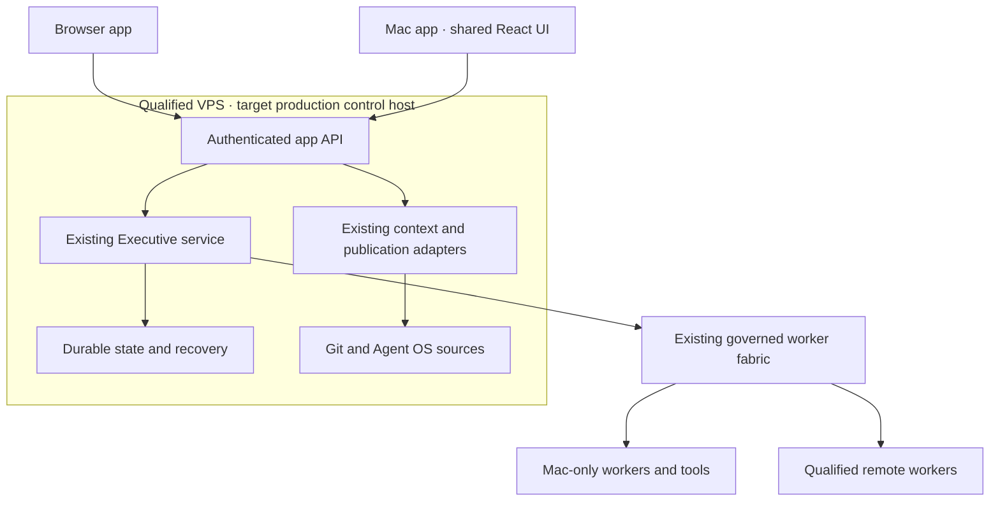

# Mastermind OS — production master plan

**Date:** 5 October 2026  
**Commission:** Chairman-directed app production assessment, plan and initiation  
**Program:** existing Mastermind OS product convergence, under #600 / `WS:EXECUTIVE-CAPACITY-FABRIC`  
**Product implementation carrier:** [Mastermind #1225](https://github.com/mastermindx-market-intelligence/Mastermind/pull/1225)  
**Status:** production program initiated; implementation exists; full daily-use and server-continuity acceptance remain incomplete.

## 1. Decision

Build the approved Atelier experience as **one TypeScript/React application**, use **Vite** for its browser and packaged frontend builds, retain **Tauri 2 with a small Rust host** for macOS, and retain the **existing Python Executive/backend**. Use the existing Node-based Studio/workspace integration where it owns source publication. This is a migration and completion program, not a rewrite.

The production destination is a **server-backed personal company operating system**. The browser and Mac app are clients of the same authority. The existing Executive service, its durable state and its always-needed dependencies should ultimately run on the qualified VPS so that closing the app or restarting the M2 does not stop the company. Mac-only execution remains on governed Mac workers.

**Electron is an alternative desktop container, not the current production choice.** Reconsider it only if an actual supported-Mac test establishes a required WKWebView limitation, a critical desktop integration substantially favors Node/Electron, or measured maintenance cost justifies replacing the native host. The React UI and server contracts remain reusable in that event. Neither Electron nor Tauri supplies server durability by itself. [P1–P4]

This plan establishes product sequencing and acceptance under the current Chairman commission. It does not transfer an incumbent source writer, activate a service, widen a grant or declare the Linux control-host amendment protected. Those changes retain their existing owners and precise acceptance gates.

## 2. What already exists

### 2.1 Frozen evidence baseline

| Surface | Observed identity | Meaning |
|---|---|---|
| Protected Mastermind | `7eac3ec252475600147ec9a376b8ca16403ac4c5` | Source/procedure baseline for this assessment |
| App candidate #1225 | `e6f8c7ee51a886c953baa84ffbbc39e643d9b1d4` | Open, draft, unmerged; existing Noir product and integration work |
| Design #1010 | `29cf30d21e61901c7025a2e53d7d3a63d10a974f` | Approved Atelier direction and detailed daily-flow specification; draft source carrier |
| Macro main | `8caf40ff8d81be0faca6f20d90d6f0e51c9cd420` | Current organizational record read, not installed-source proof |
| Installed Executive observation | Mastermind `5b244a2bbe4c2a94ec25a887eb4a0d8fafe1ea2f`; Macro `88804ed7079700c598bb8e04aa64307d1335402d`; server 1.4.0 | Read-only observation at 2026-10-05 07:57:54 UTC; installation differs from protected source and candidate |

The installed observation reported 13 Jobs: 9 completed, 1 failed, 3 queued and 0 running; one available worker was visible. These are a bounded dated observation, not app acceptance, a current capacity reservation, or proof that a specific local CEO is running. The observed database path is `/private/var/db/mastermind-executive/control/db/data/control_plane/executive.sqlite3`. A filesystem path alone does not attest host identity. [S1–S5]

### 2.2 Preserve the implementation

The app is already a TypeScript/React/Vite project with a Tauri/Rust host. Candidate `package.json` declares React 19.3.0, Vite 8.3.0, TypeScript 7.0.2 and Vitest 5.0.1; Tauri dependencies are on major 2. These are **observed project declarations**, not recommendations to upgrade to a nominal latest release. Reproduce the checked-in npm/Cargo lockfiles before changing dependency versions. [S6]

Two older command-foundation PRs, **#1046 and #1150, are merged**. Candidate #1225 already adds the actual host composition, optional Executive authentication, verified owner context, atomic principal-scoped IndexedDB pointer reservation, original-operation recovery, source publication, exact static asset packaging and default-off installation seams. Its latest owner return reports substantial frontend, Rust, Python and Studio validation. Those reports support source confidence; they do not replace installed user-journey proof. [S3, S7]

The current app is still short of the complete daily experience:

- Its company navigation exposes the five approved destinations **plus** Work, Programs and Fleet & Capacity and legacy mission destinations.
- Project selection opens the Mission workspace; the approved five-tab project home is not yet the normal route.
- The daily Conversation view is observed/read-only. It does not yet supply a durable addressed conversation and enabled governed Send.
- Knowledge/source reading does not yet complete the selected-source-to-original-draft journey.
- The current public deployment composition forwards from VPS Caddy/Chisel back to the Mac. It therefore retains an M2 availability dependency.

These are concrete completion tasks against the existing app. None justifies throwing away its authentication, authority, persistence or domain code. The companion **production acceptance matrix** maps all fifteen design scenarios and the current candidate gaps. [S8–S10]

## 3. Ownership and consolidation

### 3.1 One app program, preserved specialist owners

| Responsibility | Current carrier or owner evidence | Production responsibility |
|---|---|---|
| Product architecture, Atelier fidelity and this master plan | Current Chairman-assigned Web principal; design #1010 | Own the product promise, shared plan, cross-system decisions and acceptance ruler |
| App implementation and integration | #1225; latest recorded native root `01a10935-3e46-7b50-8e81-fe459e3a9319` | Retain the existing local Codex integration lead and its source custody; complete browser/native integration |
| Backend receipt semantics | #1222, merged; current integration consumed by #1225 | Preserve original intent/work reference/status recovery; fix new defects through that owner boundary |
| Runtime, exact-parent interaction and autonomy | #600, #1143 and the existing Executive/COO/RuntimeBinding/Wake owners | Qualify real execution and conversation return; no new app scheduler |
| Capacity and economical worker routing | `WS:EXECUTIVE-CAPACITY-FABRIC`; existing #1228/#1247/#1248 owners | Supply admitted execution, budgets and placement; an app does not choose account identities |
| Pro-led project enhancement | #1056 / #1059 | Preserve the initiating Web implementation lane; do not reassign its enhancement to the base team |
| Disaster recovery | `WS:EXECUTIVE-OS-DISASTER-RECOVERY` | Reuse export/restore primitives, key custody and recovery proof for the server migration |
| Public edge, authentication and installation | #1225 runbook and existing DNS/Auth0/Studio/Executive service owners | Finish concrete setup and release; retain exact registration/effect custody |

The #1225 pickup comment records an explicit Chairman-assigned replacement native root and preserves the retired root's original workspace and seven unpublished files. That is stronger ownership evidence than a PR author name. It is still a dated receiver/custody record, not permission for this Web session to resume or replace that native process. Read the current PR and source custody before each dependent implementation action. [S11]

**Disposition of existing plans:**

1. Retain #1225 and its history as the app implementation carrier. Do not close/recreate it to adopt this plan.
2. Retain #1010 and the approved Paper pages as the design contract. This plan adds production architecture and sequencing; it does not supersede the detailed interaction states.
3. Preserve the command-binding and Executive-transport specifications. Replace stale statements about uncomposed providers with the exact #1225 implementation evidence, through the incumbent writer.
4. Retain `docs/runbooks/mastermind-os-public-launch.md` as the **current Mac-backed alpha installation** procedure. Its tunnel topology is transitional; it cannot satisfy the final M2-independent service criterion.
5. Preserve #1056/#1059 as enhancement work. Its future coordination mechanisms may be consumed after their own source/install/acceptance gates, without renaming them or transferring their existing writer.
6. Add the VPS control-host amendment to the existing Executive and DR programs. The current multi-host design explicitly keeps a single canonical control host; it describes remote workers, not an accepted Linux control-service migration. [S12–S15]

This document is the shared production roadmap. It is not a second organizational registry. Actual work status stays in the existing GitHub/Agent OS/Executive owners; Linear may project a short milestone view after source records are saved.

## 4. Product promise and release boundaries

### 4.1 The daily job

Mastermind OS should let the Chairman understand what matters, give direction to the right accountable owner, and see the result without supervising every worker or discovering the infrastructure.

The main loop is:

1. Open **Today** and see a small, qualified account of attention, progress and the next useful result.
2. Open the exact **Project**, understand its outcome, plan and current owner, and enter its conversation.
3. Give direction to **Project Sol**, or use the one company **Meta-CEO** office for cross-project direction.
4. The existing backend admits, routes and records authorized work. Routine team review stays with its accountable owner.
5. Read the return and evidence. Make only a genuinely reserved Chairman decision.
6. Return to the original project/conversation with the same selection, draft and reading position.

The global navigation is **Today / Projects / Inbox / Conversations / Knowledge**. Each project has **Overview / Plan / Work / Evidence / More**. Operational details remain available contextually. Labels, counts and summaries must come from qualified sources; an unavailable feed is never disguised as an empty company. [S2]

### 4.2 Three honest release labels

| Release | User can rely on | Must not imply |
|---|---|---|
| Private alpha | Sign in, read real bounded project/work/evidence state, use the qualified launch capability where installed, recover original operations | Complete chat, complete company coverage, autonomous project delivery or M2 independence |
| Daily-use beta | Addressed two-way conversations, scoped drafts/return, exact projects, meaningful work and review results, signed Mac delivery, recoverable failures | Unlimited autonomous execution or high availability without its proofs |
| Production v1 | Daily journeys accepted; central service survives M2 restart; restore/cutover/update procedures tested; original-parent work loop reliable | Zero downtime under every server failure, automatic split-brain failover, or capability for every future tool |

Do not delay a useful read alpha until all infrastructure is rebuilt. Equally, do not call an alpha complete because many tests pass. The daily-use beta requires working conversation and project loops; production v1 also requires the server-continuity criterion.

## 5. Software stack

| Layer | Decision | Why it fits |
|---|---|---|
| UI and domain presentation | TypeScript + React | Already implemented; shared browser/native views and typed contracts |
| Frontend build | Vite, existing npm lockfile | Private authenticated workspace; no established SEO or request-time rendering requirement |
| Styling and illustration | Existing Atelier CSS/tokens, local licensed fonts and approved assets | Preserve the actual product design; do not introduce a competing component theme |
| Mac container | Tauri 2; narrowly scoped Rust commands/plugins | Existing native authentication/transport boundary; retain tested work |
| HTTP/MCP adapter | Existing Python ASGI/Starlette/MCP/uvicorn composition | Existing fixed authentication and transport owners |
| Executive engine | Existing sealed Python control service | Existing Job/Attempt/event, admission, reconciliation and lifecycle semantics |
| Source publication | Existing Studio Node/workspace/Git owner | Same immutable commission and custody path; browser gets no Git credential |
| Durable runtime state | Existing SQLite database on the control host's local durable disk | Preserve mature transactions and recovery semantics while changing host placement |
| Edge and supervision | Existing Caddy/qualified VPS provisioning; qualify Linux systemd control-service installation | Reuse current operators; no Kubernetes or new server platform required for the first production target |
| Identity | Existing Auth0 issuer, separate public web/native registrations and resource grants | Preserve authorization separation and already-built PKCE flows |
| Quality | Existing Vitest/Testing Library, Python and Rust suites, plus real browser/Mac and recovery journeys | Source tests plus the missing user/runtime evidence |

Do not migrate to Next.js simply because it is a popular production framework. Vite emits deployable assets; serve them through the real production edge, not `vite preview`. If later public content, request-time rendering or a deliberate server web layer justifies Next.js, assess that boundary separately. Next static export has different capabilities from its request-time server features. [P3, P5]

Do not migrate the Executive database to PostgreSQL in the same wave as the UI and host move. Reconsider the database only after evidence demonstrates a writer-throughput, availability or operational requirement the current owner cannot satisfy. SQLite WAL assumes a shared-memory relationship on one host; the database must not be shared read/write over a network filesystem. Use the existing proper backup/restore primitive rather than copying an active file casually. [P6, P7]

## 6. Target deployment and the meaning of “brain”

The always-on brain is principally deterministic services and durable state: accepted intent, jobs, exact bindings, permissions, project context, attention and result history. A language model reasons when a real task or decision requires it. A Pro chat must not remain continuously generating to keep the system alive. [S16]

There are three different continuity requirements:

- **Client continuity:** browser/tab/app closure preserves accepted work and restores the user's context.
- **Control-host continuity:** Executive or VPS restart recovers committed work, reconciles interrupted effects and preserves identity.
- **Worker continuity:** M2 restart makes its local work unavailable; other qualified work can proceed, while exact Mac-bound or ambiguous operations remain attached to their original owner until reconciled.

The server cannot complete a task that requires an offline Mac desktop, local file, signed-in native tool or device-bound credential. The product should say what is waiting and which owner resolves it. It must not show “running” merely because a request was queued.

### 6.1 Current topology versus target

The current #1225 runbook uses VPS Caddy/Chisel to a loopback service on the Mac. That is a useful private-alpha path and already has source preparation. It is **not** the target service-continuity architecture. [S10]

For the final VPS target, qualify every dependency on the path to useful work:

- Executive control service and its one authoritative database;
- app gateway, static assets and Workspace/Content projections;
- immutable commission publication through the existing Studio/workspace/Git owner;
- Agent OS context and sealed source/artifact acquisition;
- authentication, audit sinks, service identity and fixed resource grants;
- worker broker, Capacity and exact-parent dialogue/return;
- backup destination, key custody and restore tools.

If source publication or project-context generation still requires the M2, the service may recover old work but cannot accept useful new work while the M2 is off. That partial result must be named and repaired before the final acceptance drill.

### 6.2 Supported operating modes

**Production default:** browser and Mac app connect to the same VPS authority. The Mac app does not launch a second Executive database.

**Development:** an explicitly isolated local environment may use disposable fixtures/test state. It must visibly identify itself and never masquerade as production.

**Offline client:** keep permitted local drafts and clearly labeled last-known metadata where authorized. Do not add an automatic offline command queue in v1. A user may prepare a draft while offline; a command becomes accepted only when its existing server owner confirms durable admission.

**Optional local-only installation:** possible later as a distinct complete deployment profile. Do not silently switch production clients to a second local authority during a network outage.

## 7. Frontend/backend integration contract

The frontend is the part the Chairman sees. It renders the design, holds the current selection and draft, and explains the state of work. The backend verifies who is asking, owns durable records, runs the authorized workflow and returns evidence. The two connect through narrowly defined, versioned requests and responses.

The browser must not read the Executive SQLite file, shell out to workers, possess Git/provider credentials, or guess ownership from UI labels. The native host supplies only its approved platform operations. A view component does not own a lifecycle transition.

### 7.1 Existing interfaces to preserve

| Interface | Existing purpose | Completion requirement |
|---|---|---|
| `/workspace/programs/current` | Bounded program/project-source reading | Preserve coverage, source generation and exact work-reference resolution |
| `/workspace/work/current` | Root work queue observation | Preserve root identity, lifecycle, capacity/effect and acceptance distinctions; add project joins only through qualified owner data |
| `/workspace/mission/current`, `/workspace/mission/v3/current` | Current bounded mission graph | Preserve selected root/source and closed schemas |
| `/workspace/result/current` | Exact returned result | Keep complete result selector/digest and actual-origin return |
| `/workspace/window/current` | Permitted current conversation/window observation | Observation alone does not establish a durable addressed conversation or Send capability |
| `/os/executive/context` | Candidate verified opaque owner context | Bind actual authenticated principal, resource, expiry and host generation |
| `/os/executive/submit` | Candidate fixed existing CEO intent submission | One original publication/submit; accepted means queued, with `dispatched=false` |
| `/os/executive/status` | Candidate original-intent reconciliation | Recover the existing operation; no inferred resubmit after loss or not-found |
| Studio internal commission preparation | Candidate source publication before admission | Existing custody, exact file/ref and independent bearer/template qualification |

The final four rows are candidate #1225 integration, not evidence those routes are currently enabled publicly. Read and command grants remain separate. The immutable UI configuration currently maps a displayed project reference to a **department**; it must not be promoted into general project creation or portfolio identity. [S3, S9, S10]

### 7.2 Missing joins to implement through the incumbent owners

1. **Project home:** project/workstream identity, accountable role, plan revision, selected root/work and evidence references. Never equate a display title, department, runtime root or provider session with a project.
2. **Addressed conversation:** logical recipient/responsibility, project/topic, exact current session binding when needed, message revision and delivery/response states. Conversation history belongs to the existing conversation owner, not scraped provider transcripts.
3. **Governed send:** use the existing interactive turn/Company Dialogue/Session Bridge ownership after its actual route is qualified. Do not repurpose Mission LAUNCH as arbitrary conversation Send or make a hidden paid API supervisor.
4. **Chairman decision:** a reserved decision with current options, evidence, consequence, authority and expiration. Routine team review stays out of the Chairman's Inbox.
5. **Knowledge/source reuse:** exact reference/revision, permitted excerpt, explicit Add action and guarded Undo in the original unsent draft.
6. **Cross-device recovery:** a local pointer helps its original client reconcile; IndexedDB by itself is not cross-device discovery. Other clients need the existing owner to expose permitted outstanding work by actual principal/responsibility, without inventing an app queue.

For every new boundary, the owner freezes a closed schema/version, positive and negative fixtures, identity and freshness rules, permission behavior, size limits, and correction semantics. Generate or validate TypeScript representations from that owner contract where practical. Do not use broad JSON bags or invent a large generic command API just to make buttons work.

### 7.3 Failure behavior is part of the UI

Keep **draft → sending → durably accepted → delivered → responding → response received** distinct where the owner can prove those states. Keep **returned → reviewed → accepted → released** distinct for work. Do not fabricate progress between observations.

Auth loss clears protected content immediately and fences late callbacks. Preserve drafts only in their permitted principal/project namespace. A stale source or unavailable feed carries an explicit limitation and a bounded recovery action. A lost modifying response retains the original operation and offers reconciliation. A repeated click, changed selection, token refresh, app reopen or browser crash must never mint a duplicate operation accidentally.

## 8. Delivery sequence

The stages below are acceptance milestones, not new Runtime statuses. The local lead may overlap disjoint source work, but each real capability must be demonstrated through its actual consumer before its stage is called complete.

| Stage | Outcome | Lead and dependencies | Exit evidence |
|---|---|---|---|
| 0 — Consolidation | One accepted production target and current estate map | Web principal; existing #1225 owner | This plan, fifteen-scenario matrix, ownership/architecture intake on existing carriers |
| 1 — Installed private alpha | Real authenticated browser reads and qualified launch/reopen | Existing #1225 integration + auth/edge/install owners | Exact installed release/config, actual permitted feeds, one original launch and status-only lost-response recovery |
| 2 — Canonical daily shell | Five global destinations; exact project home with five tabs; responsive Atelier fidelity | Existing product writer; can proceed while Stage 1 waits on auth | Real browser navigation/keyboard/return checks against current design; no duplicate global machinery |
| 3 — Real conversation | Addressed Meta-CEO/project conversation with drafts, governed Send and actual return | Product + existing dialogue/session/runtime owners | Actual message accepted, consumed by correct target, response returned to original conversation; failure/reconnect/draft evidence |
| 4 — Complete project loop | Direction → accepted plan → work → review/evidence → outcome | Existing project/Executive/Agent OS owners; Stages 2–3 | One real bounded project segment, routine review handled by team, reserved decision only when warranted |
| 5 — Knowledge and recovery | Find/read/reuse source; original context and unsent text retained | Product + existing source/conversation owners | Real selected source, explicit excerpt insertion, guarded Undo, unavailable/changed source cases |
| 6 — Mac beta distribution | Signed, notarized Mac app with governed updates | Existing native/release owner; Stages 1–3 | Install, login/deep link, keyboard/IME, update interruption, old-client compatibility and reopen on actual Mac |
| 7 — VPS portability | Existing control authority runs on qualified Linux without losing its boundaries | Executive host + Studio/workspace + DR owners; bounded architecture amendment first | Portable service identities/sockets/storage/install; equivalent positive/negative tests; inert isolated restore drill |
| 8 — Single-authority cutover | VPS accepts and recovers useful work with M2 off | Existing runtime/release/DR owners; Stage 7 and exact cutover gate | Old writer fenced; final backup/restore; authoritative server handover; M2-off, server-restart and restore proofs |
| 9 — Daily-use production acceptance | Entire product simple and dependable in repeated real use | Product principal + independent reviewer + Chairman | All applicable scenarios passed, five consecutive working days of core journeys, defects resolved, release/rollback and ownership recorded |

Stages 2, 3 and the Stage 7 architecture/portability investigation can progress in parallel when source ownership is disjoint. The public alpha does not need to wait for the full Linux migration. The final M2-independent acceptance does.

### 8.1 First local continuation — finish what is already almost integrated

**Receiver:** incumbent #1225 local lead, latest recorded root `01a10935-3e46-7b50-8e81-fe459e3a9319`. Preserve its actual current workspace and branch. The older `/Volumes/Mastermind/agent-workspaces/codex/3426/Mastermind` is preserved historical custody, not permission to resume the retired root.

**Mission:** complete the existing browser/native alpha installation contract and prove one real original-operation launch/reopen through the approved app and backend.

**Read:** current #1225 full carrier and pending effects; latest protected procedures; this plan and acceptance matrix; current `docs/runbooks/mastermind-os-public-launch.md`; current backend/command/auth contracts; exact release/CI evidence.

**Act in order:**

1. Reconcile current candidate, immutable source, branch writer and already-owned CI observer. Do not rerun accepted suites without a material invalidator.
2. Consume this production direction and report the minimal adoption delta: current alpha gates versus next daily-shell/chat milestones. No second app/repository is needed.
3. Finish the existing concrete DNS/Auth0/permission/config setup as soon as its named authentication gates are satisfied. The previous owner already supplied the Chairman login instructions; do not ask the Chairman to invent settings or authorize the same ordinary work again.
4. Verify current required CI/review, perform release through the existing owner and install only the accepted exact source/configuration.
5. Execute the actual alpha journey and deliberate lost-response/reopen test. Prove one publication, one submit, one Job, original work reference, status-only recovery and no fabricated worker execution.
6. Return exact release/config identities and user-journey evidence on #1225. Name any remaining gate and continue the disjoint daily-shell/chat work under current custody.

**Held effects:** #633 and any other original uncertain operations remain with their exact owners. JOB-013 is unrelated acceptance evidence and must not be reused or given an invented app pointer. A rejected or absent original submission is not permission for a fresh retry without the incumbent reconciliation rule.

**Delivery truth:** publishing this packet on #1225 makes it reviewable. It does not by itself prove a new native pickup, exact-session wake, execution or automatic continuation. Use the current proven native delivery/RuntimeBinding path if available; never fabricate an opaque session target from the UUID.

### 8.2 First independent Web production work

This Web lane owns the shared plan, stack decision, current code/design comparison and fifteen-scenario acceptance artifact. These are disjoint new documentation paths, leaving all #1225 app/auth/runtime/ops files with the incumbent writer.

After plan publication, the next useful Web contribution is a **frozen conversation/project contract package or an exact candidate visual/flow review**, selected with the local lead's current path map. Where a bounded UI module can be owned independently, Web may implement and test it through an isolated permitted source lane. Do not mirror an active native module just to claim Web progress.

The purpose of using Web first is to spend high-context reasoning on product decisions and reduce implementation ambiguity. Native work need not wait for another Web handoff when its current scope is already clear.

## 9. VPS migration: complete specification before cutover

### 9.1 Portability work

The current protected host contract names a Mac Studio control host. The control service contains macOS-specific socket activation and cross-user access logic; existing Linux worker templates do not prove the Linux control service. Port those specific host-adapter boundaries under the existing service owner. Preserve the sealed-runtime packaging, authenticated socket identity and application/worker separation. [S12, S13]

The first bounded server packet must inventory actual current host/service generations, database/storage roots, source publication, context/artifact paths, auth/audit dependencies and Mac-only assumptions. It must return the exact portability changes and an inert Linux qualification plan. It must not provision a second live Executive or copy current credentials into a new service.

Run the existing Runtime/adapter positive and refusal cases against the Linux install profile. Verify service user identity, permission boundaries, graceful shutdown, restart recovery, fixed ports/sockets, configuration integrity, clock behavior, disk-full behavior, backup creation and external-effect reconciliation. Use disposable data for the first qualification.

### 9.2 Single-writer cutover

1. Reconcile current live/queued/unknown work and assign each to a supported continue, drain, retain or stop path. Do not simply kill a working control process.
2. Freeze new admissions through the existing maintenance owner, then drain or quiesce **all** canonical mutators: in-flight requests, worker/result ingestion, lifecycle transitions, heartbeats/leases, reconciliation and event appenders. Preserve read-only visibility where the maintenance contract permits it and show a clear maintenance state. A zero running-Job count or admission freeze alone is insufficient.
3. Fence/disarm the old authoritative writer and every automatic activation path; prove it cannot resume after M2 reboot. Take the **final** canonical consistent backup/checkpoint from that fenced, quiescent state through the approved backup owner. Record immutable source/schema/config, database and event-tail identities and verify that no canonical write occurred after the checkpoint. Any earlier precopy is only staging evidence. Store an encrypted off-host copy through the existing DR owner.
4. Restore into the qualified VPS target while it remains non-authoritative. Verify integrity, logical state, original intent/result identities, principal boundaries and required dependencies. Prove the target's canonical state/event tail equals the final fenced-source checkpoint, including every acknowledged mutation. If equality or quiescence is unknown, do not activate.
5. Only after old-writer retirement and exact final-state equality are verified, activate the one new authoritative writer under the existing runtime/release transaction. Retain the old-host fence through all validation and any rollback decision.
6. Repoint app/worker traffic through the existing authenticated edge and current host-generation bindings. Preserve original operation identity; reject stale host/session generations.
7. Admit a fresh bounded canary through the app. Verify actual worker return and original-parent consumption. Reconcile previously held work only under its own owner.
8. Perform the M2-off and VPS-restart acceptance drills. Reopen a pre-cutover persisted app operation, reacquire current authorized context after the host-generation change, and resolve the same logical operation from migrated state without publication or resubmit. A stale context/bearer must refuse its action without stranding the original recoverable pointer. Save measured interruption/recovery and exact release/backup identities.

Rollback before the new authority accepts any writes may restore the known previous authority after fencing the candidate. **After the VPS accepts writes, do not turn on the old stale database.** Fence the VPS writer and reconcile/migrate its latest state through the existing restore/cutover owner, or roll the service code forward. Never run both copies as authorities.

### 9.3 Disaster recovery and service objectives

The existing DR program already contains export/encryption/restore work and a hosted clean drill; its durable record still separates that from live-production backup, independent key custody and full-host recovery. Its accepted architecture targets a 24-hour RPO while armed and read-only availability within four hours, including host provisioning; modifying work resumes only after effect reconciliation. These are existing targets, not proof of present performance. Reuse that owner and its pipeline. Do not build a second backup engine. [S14]

Proposed v1 engineering targets, to be accepted after the first measurements:

- Zero loss of **acknowledged** work from ordinary client or M2 restart.
- Zero duplicate modifying effect in the covered submission/recovery cases.
- Off-host recovery-point objective of at most 15 minutes for catastrophic control-storage loss, if the existing backup owner can meet it safely at measured load.
- Full service recovery objective of at most 60 minutes after a tested restore procedure; record what depends on attended authentication or provider recovery.
- Same-day visible alert for a missed backup/failed restore qualification through existing observability, not another monitoring database.

The 15-minute/60-minute goals are proposed improvements to the existing 24-hour/four-hour recovery declaration, not silently adopted source law or current guarantees. The DR owner must assess and accept the scoped cadence/storage/recovery amendment before those goals become a release commitment. If the existing export cadence or external authentication cannot meet them, the owner returns the measured limitation and smallest remedy; the release record must state the actual accepted recovery declaration.

## 10. Updates, UX quality and operational robustness

### 10.1 Updates

The browser UI can be updated by deploying a new validated asset set. Existing tabs may retain older code, so API compatibility and an unobtrusive update/reload flow remain required.

The Mac app should ship bundled frontend code and receive signed versioned releases. Tauri provides a signed updater mechanism; its update signature and Apple's code signing/notarization are separate requirements. Do not load arbitrary remote frontend code into a privileged native bridge to avoid maintaining releases. [P8–P10]

Support at least the current and preceding qualified client/API contract during a staged release where feasible. An unsupported client gets a clear upgrade path and must not submit commands it cannot interpret. Draft and pending-operation migrations must be reversible or explicitly qualified before rollout. Do not restart the Mac app automatically while an unsaved draft or unresolved operation needs attention.

### 10.2 Product-quality acceptance

Match the approved Atelier hierarchy, typography, surfaces and illustrations across desktop and mobile; preserve visual calm by moving implementation details out of routine flows. Reuse approved images and locally licensed fonts. The existing nine-asset bundle and its licenses are a starting point, not evidence every screen matches the design.

Test 1600px desktop, 390px phone, 320px constrained width and enlarged text. Validate actual keyboard focus, screen-reader names, focus return, touch targets, reduced motion and IME behavior. No critical action may depend solely on hover or icon interpretation. Loading, empty, partial, stale, denied, offline and unknown-effect states are first-class journey states, not afterthought popups.

Proposed responsiveness targets: immediate local control feedback, a visible acknowledgement while network work is pending, and stable reading/draft position during updates. Measure real page and interaction timings on the supported browser and Mac rather than claiming performance from framework choice. Avoid ornamental animation that competes with work.

### 10.3 Security and correctness that directly affect use

Continue the current separate Workspace, Content and Executive grants. Token or subject changes must not expose another principal's draft, result or pending operation. Native credentials remain in their qualified host boundary; do not introduce persistent refresh tokens or a Keychain migration incidentally to improve login UX. If repeated authentication is a measured daily-use problem, propose that session-policy change through its actual owner.

Use stable operation identity, backend authorization, optimistic UI only for presentation, and truthful reconciliation. Retain the same-operation constraint through app updates, network loss, device restart and selection changes. App-side pointer persistence is not a server queue, a permission grant or proof of remote execution.

## 11. Web and local AI execution model

Use **Web Astra for consequential architecture, design, synthesis and adversarial decisions**. Use the **existing local Codex delivery lead** for source integration, dependency installation, real browser/native testing, service packaging and host-bound proof. The local lead can remain Astra under its current assignment; do not replace a productive incumbent to satisfy a model preference.

For subsequent sustained delivery, the existing operating-law direction favors a qualified Sol operating executive, with Astra consulted on meaningful strategic changes. A model name in a catalog is not proof of an admitted native operating profile. Adopt such a responsibility/model transition only at a lawful clean boundary, with actual capacity and continuity evidence. [S16, S17]

Bounded workers receive independently useful outcomes, not a copy of the full conversation. Typical concurrent lanes are:

- frontend navigation/conversation UI;
- backend conversation/project contract;
- Linux service/DR portability;
- independent integration or visual review.

The actual concurrency limit is the minimum of ready disjoint work, admitted capacity, source custody and the lead's ability to review/integrate. Start with a small number of complete lanes; do not multiply every worker's allowed fan-out. Preserve one original root budget including review, repair and parent consumption. Keep mechanical checks and unchanged-state waiting with existing deterministic tools.

**Can the existing Fabric help?** Yes: #1225 records a real governed review return with transferred source evidence and settled cleanup. That is useful bounded proof. It is not proof that every desired provider, model, recursive hierarchy or unattended end-to-end workflow is admitted. Consume the current #600/#1143 and Capacity gates before wider orchestration. [S3, S17]

**Can all work start in ChatGPT Web?** A large part can: architecture, code review, specifications, fixtures, independent source modules where tools/custody permit, documentation and design. Native work is required for the actual Mac app, host-bound authentication, signed packaging, local worker tooling and current install/restore ceremonies. This should be an overlapping collaboration, not a complete restart at the handoff.

Do not implement the app's AI by assuming a ChatGPT subscription is a generic backend API. Use the existing qualified provider/session/interactive-turn adapters. If an API-based capability is needed, expose the separate route, cost and budget decision rather than silently changing the economic model.

## 12. Planning estimates and release decision

Plan by observed acceptance gates. Agent-hour or token estimates cannot be credible until the current #1225 installation and real conversation adapter are measured. The largest uncertainties are authentication administration, exact-parent conversation/worker return, Linux service portability, and actual daily-use defect repair.

The first scheduling checkpoint should occur after Stages 1–3 yield real evidence. At that point, the local lead returns remaining bounded tasks, actual cycle times, dependency owners and concrete dates for beta and production. A deadline forecast must include authentication, review and restore work rather than counting UI files alone.

Production v1 is accepted only when:

1. The core fifteen design scenarios and extensions pass on the actual app with named evidence and explicit supported scope.
2. At least one real project completes its governed direction/work/review/return loop without routine Chairman relay or worker placement.
3. The Chairman can use the app over five consecutive working days without losing a draft, finding the wrong project, or being asked to manage routine infrastructure.
4. The Mac application installs/updates safely and recovers its original state.
5. With the M2 shut down, a separate browser can reach the service, read current permitted context, submit an independently executable task and see its result; Mac-only work is honestly waiting.
6. VPS process restart and an independent restore drill preserve accepted identities and avoid duplicate effects.
7. Current release, ownership, backup/rollback and remaining limitations are durably recorded; source tests, production evidence and user acceptance remain distinguishable.

## 13. Initiation and next action

This commission begins by consolidating the existing app, assessing its actual source against the accepted experience and publishing the master plan plus acceptance matrix. The immediate implementation action belongs on **#1225**, with its existing local owner: finish the concrete private-alpha installation and original-operation proof, while adopting the daily-shell/conversation milestones and preparing the bounded VPS portability amendment.

The program principal remains responsible for consuming that return and resolving architecture/UX ambiguity. Posting a plan is not completion of the app, an automatic native wake or a live deployment. When only an actual login/host/capacity boundary remains, preserve the exact carrier and next action rather than creating another owner or asking the Chairman to reconstruct the project.

## Evidence references

### Project sources

- **S1:** [Protected source](https://github.com/mastermindx-market-intelligence/Mastermind/tree/7eac3ec252475600147ec9a376b8ca16403ac4c5); same-pin `docs/sol_skills/INDEX.md` and active execution/source-custody procedures.
- **S2:** [Daily-flow specification at design head](https://github.com/mastermindx-market-intelligence/Mastermind/blob/29cf30d21e61901c7025a2e53d7d3a63d10a974f/docs/design/MASTERMIND_OS_DAILY_FLOW_SPEC.md); [Paper canonical Atelier](https://app.paper.design/file/01M3NRCX55B452A12819WNE1RH/p-D-0); [builder flow notes](https://app.paper.design/file/01M3NRCX55B452A12819WNE1RH/p-E-0); [conversation family](https://app.paper.design/file/01M3NRCX55B452A12819WNE1RH/p-C-0).
- **S3:** [#1225 latest source return, 5988489972](https://github.com/mastermindx-market-intelligence/Mastermind/pull/1225#issuecomment-5988489972).
- **S4:** [Macro current record tree](https://github.com/mastermindx-market-intelligence/macro/tree/8caf40ff8d81be0faca6f20d90d6f0e51c9cd420/agentos).
- **S5:** Mastermind Executive V3 `executive_state` read, 2026-10-05T07:57:54Z, `mastermind.executive_mcp_result.v1`, readonly installed runtime; reported source identities and counts reproduced in §2.1. This direct observation has no invented public URL.
- **S6:** [Candidate package.json](https://github.com/mastermindx-market-intelligence/Mastermind/blob/e6f8c7ee51a886c953baa84ffbbc39e643d9b1d4/app/mastermind_os/package.json), [Cargo.toml](https://github.com/mastermindx-market-intelligence/Mastermind/blob/e6f8c7ee51a886c953baa84ffbbc39e643d9b1d4/app/mastermind_os/src-tauri/Cargo.toml).
- **S7:** [#1046](https://github.com/mastermindx-market-intelligence/Mastermind/pull/1046), [#1150](https://github.com/mastermindx-market-intelligence/Mastermind/pull/1150), [integrated source return 5987092993](https://github.com/mastermindx-market-intelligence/Mastermind/pull/1225#issuecomment-5987092993).
- **S8:** [Candidate App.tsx](https://github.com/mastermindx-market-intelligence/Mastermind/blob/e6f8c7ee51a886c953baa84ffbbc39e643d9b1d4/app/mastermind_os/src/App.tsx), [ConversationWindow.tsx](https://github.com/mastermindx-market-intelligence/Mastermind/blob/e6f8c7ee51a886c953baa84ffbbc39e643d9b1d4/app/mastermind_os/src/conversations/ConversationWindow.tsx), [useObservedConversation.ts](https://github.com/mastermindx-market-intelligence/Mastermind/blob/e6f8c7ee51a886c953baa84ffbbc39e643d9b1d4/app/mastermind_os/src/conversations/useObservedConversation.ts).
- **S9:** [Command binding spec](https://github.com/mastermindx-market-intelligence/Mastermind/blob/7eac3ec252475600147ec9a376b8ca16403ac4c5/research/MASTERMIND_OS_COMMAND_BINDING_SPEC_V1.md); candidate `compose-mission-host.ts`, `orchestration/os-executive-host.ts`, `indexeddb-pending-pointer-store.ts` and `integrations/mastermind_executive_app/os_transport.py`.
- **S10:** [Current alpha launch runbook](https://github.com/mastermindx-market-intelligence/Mastermind/blob/e6f8c7ee51a886c953baa84ffbbc39e643d9b1d4/docs/runbooks/mastermind-os-public-launch.md).
- **S11:** [Actual replacement-root pickup and custody](https://github.com/mastermindx-market-intelligence/Mastermind/pull/1225#issuecomment-5985886957).
- **S12:** [Single-control-host multi-host contract](https://github.com/mastermindx-market-intelligence/Mastermind/blob/7eac3ec252475600147ec9a376b8ca16403ac4c5/docs/superpowers/plans/2026-08-27-hybrid-workforce-mh1-multihost-broker.md).
- **S13:** [Executive service source](https://github.com/mastermindx-market-intelligence/Mastermind/blob/7eac3ec252475600147ec9a376b8ca16403ac4c5/control_plane/executive_service.py): macOS socket activation/cross-user grant boundaries; existing Linux peer-credential branch is insufficient installation proof.
- **S14:** [Existing DR workstream](https://github.com/mastermindx-market-intelligence/macro/blob/8caf40ff8d81be0faca6f20d90d6f0e51c9cd420/agentos/workstreams/WS-EXECUTIVE-OS-DISASTER-RECOVERY.md); [accepted DR architecture and original targets](https://github.com/mastermindx-market-intelligence/Mastermind/blob/7eac3ec252475600147ec9a376b8ca16403ac4c5/research/MASTERMIND_EXECUTIVE_DR_V1_ARCHITECTURE_2026-09-01.md).
- **S15:** [#1056 incumbent Web enhancement](https://github.com/mastermindx-market-intelligence/Mastermind/issues/1056), [#1059](https://github.com/mastermindx-market-intelligence/Mastermind/pull/1059), [#1222 backend](https://github.com/mastermindx-market-intelligence/Mastermind/pull/1222).
- **S16:** [Chat-native hierarchy and deterministic always-on layer](https://github.com/mastermindx-market-intelligence/Mastermind/blob/7eac3ec252475600147ec9a376b8ca16403ac4c5/docs/EXECUTIVE_CHAT_NATIVE_SOL_HIERARCHY_LAW.md).
- **S17:** [Current Sol-led orchestration integration record](https://github.com/mastermindx-market-intelligence/Mastermind/pull/600#issuecomment-5986887569), [existing exact-session program #1143](https://github.com/mastermindx-market-intelligence/Mastermind/issues/1143). Source/program evidence, not blanket live admission.

### Official platform documentation consulted 5 October 2026

- **P1:** [Tauri architecture](https://v2.tauri.app/concept/architecture/).
- **P2:** [Tauri WebView versions](https://v2.tauri.app/reference/webview-versions/), [Electron introduction](https://www.electronjs.org/docs/latest/).
- **P3:** [Vite static deployment](https://vite.dev/guide/static-deploy.html).
- **P4:** [Electron security](https://www.electronjs.org/docs/latest/tutorial/security).
- **P5:** [Next.js static exports](https://nextjs.org/docs/app/guides/static-exports).
- **P6:** [SQLite WAL host constraints](https://www.sqlite.org/wal.html).
- **P7:** [SQLite backup API](https://www.sqlite.org/backup.html).
- **P8:** [Tauri capabilities](https://v2.tauri.app/security/capabilities/).
- **P9:** [Tauri updater](https://v2.tauri.app/plugin/updater/).
- **P10:** [Tauri macOS signing](https://v2.tauri.app/distribute/sign/macos/).

Platform behavior is evidence; the selected stack, sequencing, service targets and tradeoffs are this plan's engineering judgment. Revalidate current implementation/source and provider capability before effectful execution.
