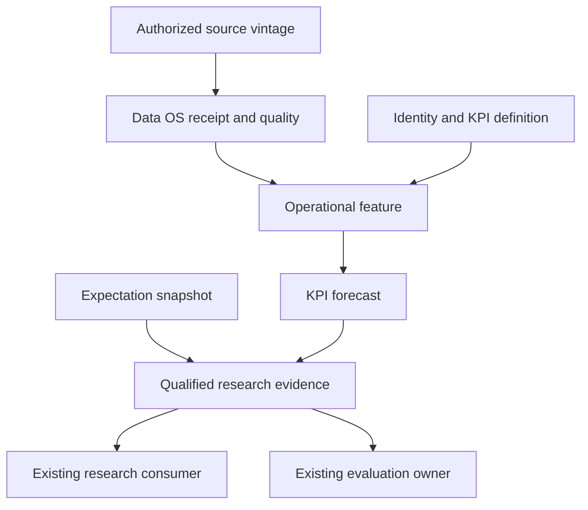

# Commission 16 — Operational Alternative Data Adapters

## Hardened research, current-source audit and implementation recommendation

**Research cut:** October 4, 2026. **Status:** complete research recommendation; implementation and predictive qualification are not claimed. **Scope:** operational observations that can improve company KPI estimates between disclosures. No production code, live pipeline, procurement, portfolio behavior or source authority is changed by this commission.

This is the full replacement for the supplied `deep-research-report (12).md`, not an addendum that requires the reader to reconstruct the earlier document. [AUDIT_EVIDENCE.md](AUDIT_EVIDENCE.md) records the corrections and evidence limits. Bracketed R/S references throughout resolve to immutable repository links or primary external sources in [SOURCES.md](SOURCES.md). Numerical acceptance examples are proposed research policy, not measured performance or universal industry standards.

## Report navigation

| Section | Contents |
|---|---|
| A | [Executive conclusion](#a-executive-conclusion) |
| B | [Current-state census](#b-current-state-census) |
| C | [State of the art and economic sensor design](#c-state-of-the-art-and-economic-sensor-design) |
| D | [Source landscape and acquisition decision](#d-source-landscape-and-acquisition-decision) |
| E | [Minimum canonical data model and temporal semantics](#e-minimum-canonical-data-model-and-temporal-semantics) |
| F | [Derived intelligence and reasoning boundary](#f-derived-intelligence-and-reasoning-boundary) |
| G | [Mastermind integration map](#g-mastermind-integration-map) |
| H | [Empirical validation program](#h-empirical-validation-program) |
| I | [Risks, failure modes and falsifiers](#i-risks-failure-modes-and-falsifiers) |
| J | [Build priority and allocation of attention](#j-build-priority-and-allocation-of-attention) |
| K | [Sequenced implementation recommendation](#k-sequenced-implementation-recommendation) |
| L | [Exact bounded follow-on implementation commission](#l-exact-bounded-follow-on-implementation-commission) |

## A. Executive conclusion

### A1. What Mastermind should build

Build **a small number of qualified operational sensors attached to existing data, identity, financial-KPI, evidence and evaluation owners**. Each sensor must answer one economic question for a defined company population. Its output is a dated measurement, an explicit KPI bridge and, where justified, a calibrated forecast with a source trail. It must remain possible to inspect a demand measurement separately from hiring intent, inventory formation, pricing, consensus and market response.

The useful sequence is:

1. Observe a lawful operational quantity and retain its original delivered vintage.
2. Resolve the measured brand, merchant, app, domain, location, product or vessel to the correct issuer and economic scope at the relevant time.
3. Calculate a small, reproducible feature set with explicit coverage and measurement limitations.
4. Forecast an exact disclosed KPI using only information eligible at the forecast cutoff.
5. Compare with the appropriate historical, contemporaneous-consensus and existing-Mastermind baselines.
6. Preserve the difference between KPI skill, expectation information and investment information.
7. Send only admitted evidence through the existing consumers. Any later authority change requires its own decision.

**The recommendation is high priority as a research capability and conditional as a data purchase.** No inspected vendor sample or Mastermind experiment establishes that a commercial feed is worth buying. The first economic opportunity is a narrowly defined US consumer-sales study, or a digital-KPI study if an existing entitlement makes that materially more feasible. Hiring composition is a valuable but different capacity/cost hypothesis; it is not automatically a near-term revenue sensor.

### A2. Ranked sensor opportunities

These are provisional research priorities based on economic proximity, available documentation, incremental-use hypotheses and execution burden. They are not an estimated alpha ranking.

| Order | Candidate | Primary measurement-to-KPI link | Why this order / qualification needed |
|---|---|---|---|
| 1 | Merchant transactions for a defined US consumer cohort | Covered purchases → sales/orders/average ticket → exact company or segment sales KPI | Short economic bridge; compare Earnest Orion, Facteus Arbiter and Bloomberg Second Measure on identical original-vintage samples. Merchant totals do not automatically measure comparable-store or consolidated revenue. |
| 2 | App usage or web activity for businesses with disclosed digital KPIs | Active usage/traffic → qualified user/order/subscriber/bookings KPI | Select app **or** web according to the business. PIT delivery through Sensor Tower’s Scheduled Data Feed is advertised; entitlement and delivery proof remain open. Domain traffic is not general SaaS revenue. |
| 3 | Hiring composition and workforce for an explicit capacity/cost hypothesis | Open recruitment and workforce changes → function/geography expansion or expense trajectory | Compare LinkUp/Revelio; consider Lightcast taxonomy only with valid vintages. Longer and sign-dependent lags make this a separate study. |
| 4 | Same-location visits where transactions leave uncertainty | Visits → demand quantity; test additional KPI accuracy beyond purchases | Useful secondary sensor, not an assumed independent confirmation or conversion denominator. Compare Placer with Advan. |
| 5 | Narrow SKU price/promotion/availability | Observable offers and availability → price/mix/constraint hypothesis | Valuable for one known product/channel exposure. Keepa is a practical candidate; ranks and badges are not exact sales. |
| 6 | Issuer-attributable customs/shipment data | Physical inputs/loadings → inventory, shipments or production constraints | Source-country-mode-specific sample comparison first. Commodity statistics alone cannot establish company operations. |
| 7 | Advertising intensity | Acquisition effort → conditional demand/expense explanation | Evaluate only after downstream measures; higher spend can accompany deteriorating efficiency. |
| 8 | Developer adoption | Economically linked ecosystem activity → product adoption hypothesis | Reuse current GitHub/Hugging Face collectors. No blanket stars-to-revenue bridge. |
| Conditional specialist | Distributor inventory or commodity cargo/AIS | Sell-in/sell-through balance or physical commodity movement | Potentially very valuable for a named semiconductor, hardware, auto, energy or shipping question; source specificity makes broad ingestion inappropriate. |

### A3. The first implementation boundary

The next accepted commission should prove **one authorized source, one temporal replay, one exact KPI bridge and one registered evaluation**, with a factual blocked result if the necessary source or label is unavailable. It should not simultaneously build transaction, digital, hiring, inventory and generic mapping systems.

P0 is eligibility, current-owner composition, original-vintage/rights diligence and a bounded real-source demonstration. Commercial candidate pilots follow only after those gates. Existing app ratings and developer counts can demonstrate receipt handling; without a defensible disclosed KPI, they cannot be passed off as a successful company nowcast.

### A4. What changed materially from the attachment

The hardening replaces three simultaneous P0 feed families with gated sequential trials; corrects stale altdata results; distinguishes protected V3 specification from its unmerged implementation; identifies existing Data OS, identity, financial and evidence interfaces; replaces a single ambiguous `known_at` rule with two explicit research replay modes; adds accounting/cohort semantics; expands the vendor comparison; and supplies a paired, dependence-aware, power-qualified evaluation design. It preserves the original rejection of an indiscriminate feed warehouse and opaque aggregate score.

## B. Current-state census

### B1. Repository identity and source cut

| Estate | Verified identity | Pinned source | Interpretation |
|---|---|---|---|
| Mastermind reasoning/portfolio | `mastermindx-market-intelligence/Mastermind`, repository ID 1317762013 | protected `master`: `a2646f458f9ff41ddcedd89b338be4a4349e6cd6` | Matches the supplied report's own audit pin, rather than the older commission-header SHA. Skillpack schema/version are compatible: v1 / 1.0.1, bootstrap major 1. |
| Macro data/intelligence/application | `mastermindx-market-intelligence/macro`, ID 1266869026 | `main`: `79251a22d731cf3f7e8d8ba2185bfcd0e9bb098f` | Newer than attachment pin `818d1bce…`. Branch API reported this branch unprotected; it is not mislabeled protected law. |
| Charting/Terminal | `mastermindx-market-intelligence/mastermind-terminal`, ID 1290596392 | protected `master`: `1c708450187755160e1a5889b69598a2fcb1f0d1` | Actual repository name resolved; not guessed as `Terminal`. |
| Research Vault product | Macro `engine/research_vault`, `app/research.py`, `scripts/ingest_research.py` and its masterplan | Same Macro pin | A Macro application/data domain. The separate `executive-dr-vault` repository is not this research product. |
| Installed Executive read-only projection | `executive_state`, generated `2026-10-04T07:19:02Z` | Mastermind `a2646f45…`; installed Macro `88804ed7…` | Useful evidence of source/runtime distinction. It does not prove the operating-sensor pipelines or published consumer generations are currently healthy. |

Repository tree reads and scoped exact-pin file reads supply this census. Search indexing sometimes returned an older Macro revision; those search results were used only to find paths. The full Macro recursive tree exceeded the usable transport; inspection changed to pinned subtrees. No missing local file or empty search was treated as proof of fleet-wide absence. [R01](SOURCES.md#r01), [R22](SOURCES.md#r22), [R27](SOURCES.md#r27)

**Final source delta before publication:** protected Mastermind advanced to `521720b09be2921e996d9396b522b1c4ca62041c`, adding only `research/TREND_PERSISTENCE_PREREG_C1.md`; Macro advanced to `59a0789c0e5ffcce15e682b6f3880f3eacc6f6fc`, changing only the associated workstream and handoff. Terminal was unchanged. Exact comparisons establish that the operational code and October 3 artifacts inspected above are unchanged. The three new/updated documents were read and are separately pinned in the manifest. Their relevant implication is now explicit: the merged C1/C2 preregistration has frozen confirmation boundaries, the open instrument remains a separate carrier, and its current sector snapshot is not era-correct historical identity. C16 must not reuse reserved outcomes or infer a historical subtheme graph from that snapshot. [R07](SOURCES.md#r07), [R27](SOURCES.md#r27)

Mastermind's `vendor/macro` topology is host-dependent. Current refresh code describes a managed checkout for applicable hosts and an external symlink/data plane on the VPS. It also has R2 synchronization and freshness checks. A stale submodule description in prose is not a safe model of every runtime. This research did not execute a refresh. [R12](SOURCES.md#r12)

### B2. Capability ledger

The state labels below refer to the specifically inspected capability. Source existence is not live operation; checked-in outputs are dated artifact evidence, not live database receipts.

| Capability | Current evidence | State / material implication |
|---|---|---|
| Static Mastermind census | `data/census/CENSUS.md` still says generated July 16, 2026, at `131290a` | **PARTIAL** current observability. Do not use its old counts as today's complete estate census. |
| Current altdata consumer | `portfolio/lenses.py::_altdata_row` reads scored intelligence or legacy convergence, returns context | **PARTIAL** operational coverage. Primarily positioning/event context, not a company KPI nowcaster. |
| Earnings expectations consumer | `portfolio/held_risk.py::_lane_earnings_expectation` reads current `expectation_state`, SUE/PEAD and revision fields | **BUILT_NOT_PROVEN** for this read-only census; no mature historical consensus/revision series is established merely by these fields. |
| SEC factor availability filter | `loop/fundamentals.py::_pit_row` selects `asof_date <= t` | **PARTIAL** temporal proof. A reader gate cannot certify the upstream timestamp or discarded restatements. The module itself discloses incomplete company coverage. |
| Delisted/PIT price substrate | `loop/single_name_panel.py` unions deep and delisted closes and reads membership spans | **BUILT_NOT_PROVEN** here for current data completeness; reuse rather than invent another price/outcome harness. |
| First-seen decision context | `brain/signal_history.py` retains first `(asof,ticker)` daily snapshot | **PARTIAL** for C16: valuable existing history, not complete intraday vendor vintages or exact consumer-read receipts. |
| App demand | Macro Quiver app-rating inputs and `app_demand` feature | **PARTIAL**: ratings/review thresholds; review velocity is a display measure. No verified downloads/MAU/retention/revenue sensor. |
| Developer telemetry | `collectors/github_repos.py`, `collectors/huggingface.py`; curated mapping files | **PARTIAL**: existing adoption/mindshare snapshots, not validated issuer revenue measures. |
| Altdata kernel/ledger/emit | `engine/altdata_models.py`, `altdata_signals.py`, `altdata_ledger.py`, `altdata_emit.py` | **BUILT_NOT_PROVEN** for current end-to-end operation; dated evaluation remains non-decision-grade. Preserve existing channels and outcomes. |
| Data OS registry/health | `lib/dataos/registry.py`, `quality.py`, `config/dataset_registry.yml` | **PARTIAL** enrollment, not a missing registry. Twenty-one registry entries at the inspected pin; bounded scan found no operational altdata/GitHub/hiring/web-traffic KPI enrollment. |
| Identity resolution primitives | `lib/dataos/identity.py`, `config/identity_seams.yml`, `lib/ticker_aliases.py` | **PARTIAL** operational identity coverage. Reuse issuer/security/vendor alias seams; a complete brand/domain/app/location/merchant temporal graph was not verified. |
| Financial KPI registry / packet | Fundamental Forensics metric catalog, mappings, `metric_registry.py`, `financial_intelligence_packet.py` | **PARTIAL** C16 bridge coverage. Existing financial semantic owners must define target basis; do not mint a competing metric namespace. |
| Evidence Foundation | `contracts/evidence_foundation/README.md` and native-reference contracts | **PARTIAL** C16 profile coverage. Existing source identity, clock, rights and digest semantics constrain the new payload. |
| Expectations research and prospective collection | Existing expectation-market program and owner/reuse matrix | **PARTIAL** historical maturity. Compose current receipt/expectation interfaces; exact analyst KPI history remains source- and entitlement-dependent. |
| V3 Decision Snapshot | Protected spec remains `SPEC_ONLY`; separate open PR #673 contains actual implementation | **SPEC_ONLY on protected master; BUILT_NOT_PROVEN on candidate.** Do not say nothing has been built anywhere or bypass its incumbent carrier. |
| Terminal company intelligence | Generation-bound Macro/R2 context through same-origin `/api/company-intelligence/[symbol]` | **BUILT_NOT_PROVEN** for C16 consumer extension. Existing UI/receipt path is preferable to another page or browser data store. |
| True operational KPI nowcaster | No first-class production-qualified C16 path in the inspected roots | **PARTIAL; first-class C16 qualification not verified within the surveyed scope**. No first-class C16 operational profile was found in the inspected contracts and registry; this census does not establish universal build absence or exclude unpublished experiments, licensed datasets outside Git, or other host files. |

Sources: [R02–R23](SOURCES.md#repository-evidence). The current `earnings_expectation` code is an existing consumer boundary, not an invitation to inject new values into its risk flags during a research pilot.

### B3. Current altdata evidence replaces the attachment's old headline

The August 13 convergence cohort adjudication remains useful historical evidence: it held adverse/insufficient results instead of changing the signal after seeing outcomes. It is not the latest data cut. The pinned October 3 track-record artifacts expose **falsifier survival** and **directional accuracy** as different quantities. The existing altdata track-record artifact has 288 graded entries, survival `0.545`, directional accuracy `0.413`, with low conviction. The brain track record has zero graded entries and 27 open. None proves incremental operating-KPI information. [R14](SOURCES.md#r14), [R15](SOURCES.md#r15)

The current family evaluation artifacts report:

| Family/horizon | Graded observations | Distinct dates | Hit rate | Mean excess return | Recorded disposition |
|---|---:|---:|---:|---:|---|
| Event / 21 | 104 | 19 | 48.08% | +0.7771% | ACCRUING; mixed-epoch pooling refused |
| Flow / 21 | 50 | 14 | 42.00% | −0.8641% | ACCRUING; mixed-epoch pooling refused |
| Mid / 63 | 22 | 6 | 40.91% | −1.2884% | ACCRUING |
| Slow / 63 | 93 | 11 | 35.48% | −2.3153% | ACCRUING |

These are source-artifact summaries, not recomputed backtests. Different dates, horizons, metrics and clock epochs prohibit pooling them into one success rate. In particular, many observations on few dates do not supply that many independent economic outcomes. The scoped census also found raw convergence count still used for ledger admission despite a co-firing adjustment being calculated for display. C16 should not broaden this existing construction/evaluation repair into its own production rewrite. Its implication is to retain measurement and dependency detail and avoid claiming that old convergence validation qualifies new operating sensors. [R16](SOURCES.md#r16), [R14](SOURCES.md#r14)

### B4. Adjacent carriers and duplicate-project prevention

| Existing carrier / domain | Observed evidence | C16 boundary |
|---|---|---|
| Mastermind #673, Portfolio V3-S0 | Open draft; API head `0b960590c77101b3f3b5545896423f9ad07b7d56`; Snapshot/contract/source/CLI/API/UI/test paths present | Incumbent Snapshot implementation. PR body retains an older head; use API identity. Do not adopt its unmerged code or create another Snapshot ledger. |
| Mastermind #669 | Open draft, records repair, head `41e94c1d6023d3dda86f64cbd15e0cbf515bb241` | Adjacent V3 architecture evidence, not evidence that implementation is absent today. |
| Mastermind #1221 | Open research: bitemporal/PIT truth; head `01fc1846471e482a4d68842ad53c6294478001e2` | Reconcile proposed semantics with current Data OS temporal owner; do not establish a second temporal standard. |
| Mastermind #1224 | Open research: data observability/live census; head `7cbb03a85cfa96b2a880c297b01fd1c8df3038d4` | Reuse health/federation direction. C16 enrolls only the selected source and consumption receipt; no global recensus service build. |
| Mastermind #1229 | Open research: regional parity; head `b502668857526d7da9fd69b9801493d387df951c` | US pilot success does not imply Hong Kong/Mainland China source parity. |
| Trend Persistence C1 / C2 instrument | C1 merged in Mastermind #1226 at `521720b0…`; instrument #1230 open at `688b2f56735ebdb8cb909c69653cd1be7acc7a55` | Separate owner and frozen confirmation population. C16 does not rerun its reserved judges or treat current sector labels as historical truth. |
| Existing Macro altdata reboot/evaluation | Current kernel, ledger and family track records plus explicit HOLD research | C16 preserves old source families, claim IDs and outcome definitions. |
| Expectation-market dynamics / VEND-0; Macro #8402 and #8337 | Existing owner matrix, current research carrier and draft explicit-cutoff consumer | Consume exact KPI/period/basis expectation snapshots; no separate analyst consensus database. |
| FIF, identity, Evidence Foundation, Research Vault, GMI/theme work; Macro #7518, #8183, #6803, #8404 | Existing code/contracts/plans and active lineage, price-receipt, temporal-grain and dossier candidates, with differing maturity | Extend accepted seams only. A cited research report or inferred company relationship is not a new operational measurement. |

All open PR descriptions are candidate evidence, not protected authority. Relevant current carriers must be rechecked before later implementation. The exact C16 title/body search found no existing carrier at research start; this package therefore uses one new documentation branch without modifying any of the above. [R09](SOURCES.md#r09), [R21](SOURCES.md#r21), [R24–R27](SOURCES.md#repository-evidence)

### B5. What remains genuinely unverified

No authenticated vendor delivery, executed license, raw transaction/mobility/person-level sample, full private Research Vault corpus, live operational data lake, or production consumer generation was inspected. No experimental forecast or investment result was produced. The principal gaps are therefore **qualified source delivery and temporal history, exact economic attribution, baseline/label access, existing-interface enrollment and measured incremental value**. The report does not equate those unknowns with worldwide data absence.

## C. State of the art and economic sensor design

### C1. Institutional measurement discipline

A sensor is a measurement instrument with an inclusion rule, not an alternative name for a trading signal. Public research on transaction data emphasizes sampling and payment/merchant classification limitations. Real-time nowcasting research emphasizes the information available at each release, including unfinished periods and delayed series. Panel inference research warns about shared firm and time dependence. Their application here is a proposed design; none of these papers validates a named vendor or predicts Mastermind's results. [S31–S35](SOURCES.md#external-primary-sources)

Every candidate requires a **bridge card**: source metric; economic population; issuer/product/segment relation; fiscal and measurement periods; accounting basis; coverage; hypothesized lag; small feature set; target disclosure; alternatives; and falsifier. The card must distinguish measurement error, predictive association and causal identification. A plausible chain is sufficient to motivate a test, not to assert a causal effect.

### C2. All requested families: what is measured and how to falsify the bridge

| Family | Quantity actually observed/estimated | Useful company KPI hypothesis | Principal bias / survivorship / sampling problem | Discriminating test |
|---|---|---|---|---|
| Web traffic | Modeled visits, unique visitors, engagement for a domain/device/geography | Qualified traffic, orders or a disclosed digital-user KPI | Small-site coverage, bots, login/support traffic, SEO/product outages, domain migration, panel/model changes; current domains omit closed sites | Improve the registered KPI beyond prior KPI, public controls and current demand evidence; test support-traffic and denominator-only placebos. |
| App usage | Store downloads/purchases and panel/model usage, depending product | Disclosed active users, subscriptions, bookings or app-mediated purchases | Downloads ≠ active users; cross-device duplication; geography/OS/store-payment coverage; publisher transfers; panel/model breaks | Match app IDs and target geography/payment basis; compare usage versus downloads versus current ratings on paired original vintages. |
| Card/payments | Panel transactions, spend, cardholders, merchant attribution | Covered sales/orders/ticket and an exact reported revenue or comparable-sales KPI | Card churn, omitted cash/B2B/international, payment processors, refunds, pro-forma ownership, source fill | Stable cutoff-valid cohorts and source-denominator controls; improvements must survive matched accounting scope and original releases. |
| Foot traffic | Modeled visits to POI/geofence | Comparable-location demand | New/closed stores, shared mall footprints, workers/passersby, device panel drift, retrospective polygons | Freeze the issuer's eligible store definition at cutoff; test added KPI accuracy beyond purchases and weather/calendar controls. |
| Job postings | Advertised recruitment, not confirmed vacancies or fills | Hiring intent and function/geography investment | Evergreen/duplicate/multi-location ads, ghost posts, ATS migration, changed taxonomy and employer coverage | Function-specific features versus raw posting count; employer-site continuity and later workforce/disclosed expense validation. |
| Hiring composition | Classified roles/skills/seniority and modeled workforce inflows | Sales/R&D/production capacity and expense mix | Profiles report late, job changes backfilled, contractor coverage differs, pro-forma hierarchy | Separate posting demand from workforce realization; stable taxonomies and organic hierarchy; predeclare sign and lag by role. |
| Customs/import-export | Source-specific trade declarations or bills of lading | Inputs, inventory formation, shipment cadence, supplier relationships | Mode/country omissions, confidentiality, forwarders, duplicate master/house lines, weights versus units, transshipment | Reconcile parties and grain; compare physical labels, not immediate EPS; control tariffs, stockpiling and sourcing relocation. |
| Shipping/AIS | Vessel positions, inferred port calls/cargo estimates | Cargo throughput, freight activity or commodity exposure | Coverage/spoofing/dark vessels, reclassification, cargo estimates, ownership inference | Cargo/port/issuer ground truth; quantify coverage breaks. AIS alone must not stand in for cargo ownership, quantity or revenue. |
| Advertising | Modeled spend/impressions, creatives and placements | Marketing effort, competitive pressure, launch activity | Channel/model coverage, gross versus net spending, organic demand response, promotions, agency brand mapping | Increment over observed demand/expense baselines; no CAC or ROAS claim without aligned acquisition/outcome denominators. |
| SKU pricing | Offered prices, coupons, Buy Box/seller and availability | Price/mix/promotion/constraint contribution | List price ≠ realized price; bundles, pack size, seller substitution, personalized offers, missing observations | Fixed vintage product/pack/seller basket; verify price unit and availability; test against disclosed price/mix or margin labels. |
| E-commerce rankings | Ordinal platform/category position or coarse badges | Relative platform demand proxy | Algorithm/category changes, sponsored placement, ASIN mergers, ties, stockouts, selected survivors | Rank adds beyond price/availability/traffic and category fixed effects; never convert ordinal movement to precise units without validated calibration. |
| Channel inventory | Authorized distributor/seller stock, shipment and sell-through information | Units on hand, weeks of supply, sell-in versus sell-through | Multi-tier duplication, consignment, backlog/cancellations, fiscal timing, inaccessible off-channel stock | Stock-flow reconciliation on a specific channel; a stale web availability flag is not a complete inventory balance. |
| Developer activity | Public repository/model/package activity | Economically linked product adoption | Stars/download requests ≠ paying users; bots/CI, campaigns, forks, library counting changes, dead-project omission | Map economic dependence first; independent commercial/adoption labels; release/campaign and request-count controls. |

Primary source support and product-specific history/methods are in D and [S01–S29](SOURCES.md#external-primary-sources), [S38](SOURCES.md#s38). Missingness is a measurement property of each row and source; it must not become zero operations.

### C3. Accounting and cohort corrections that change the plan

**Transactions are closest to covered purchases, not automatically issuer revenue.** Store systems, franchise sales, marketplace gross bookings, subscription billing and recognized revenue have different definitions. Taxes/tips, gift cards, returns, fees and currency may separate a card swipe from the target. Begin with the narrowest observable KPI and expand scope only after the bridge earns support.

McDonald's illustrates the problem: its disclosed comparable-sales population uses restaurants operating at least thirteen months, includes temporary closures and applies currency/hyperinflation adjustments. Franchised systemwide sales are not company sales revenue. A simple “same-location” panel does not reproduce that definition. Treat the company as an accounting example, not an approved pilot constituent. [S30](SOURCES.md#s30)

**Panel normalization cannot be outsourced to an unexplained vendor label.** In a synthetic example, panel spend rises from 100 to 140 and active cards rise 40%. Raw growth is 40%, while spend per observed active card is flat. Neither proves underlying company growth because the new cards may represent different consumers. A constant panel selected using future survival also leaks. The admissible cohort rule uses only observations available at cutoff and reports entry, exit and reweighting effects.

**Cross-panel ratios require aligned populations.** Dividing one vendor's card transactions by another's site visits does not estimate conversion. Adding app users to web unique visitors double-counts people unless a documented joint measure exists. A modeled deduplicated audience remains a vendor estimate. Cross-family displays can describe directional agreement while withholding unsupported arithmetic.

**Recruitment has role-specific economics.** Hiring can precede expense growth before revenue and can replace attrition rather than expand capacity. Chen and Li's historical study finds opposite profitability associations for low-skill and high-skill vacancy duration. It supports separate hypotheses rather than a universal favorable sign. The observation that an ad disappeared is not proof a person was hired. [S38](SOURCES.md#s38)

**Supply activity can precede either growth or excess inventory.** Imports increasing while sell-through stagnates can signal inventory risk. Declining imports might reflect weakness, domestic sourcing or a deliberate inventory drawdown. Shipping or customs sensors need joint demand, inventory and known policy context before interpretation. Do not infer revenue recognition from a vessel arrival.

### C4. The strongest counterargument

Even a carefully measured feed may have little value after existing prices, analyst estimates, public operating disclosures and other Mastermind signals. An expensive, widely used card or app panel can forecast a KPI accurately while supplying no incremental investment information. A cheap public issuer monthly operating release may already explain most of the target. That is why the selection unit is **source × company population × KPI × cutoff × use**, and why the program should stop buying breadth when the cheaper baseline is sufficient.

The answer is neither “all alternative data is alpha” nor “public data is enough.” It is a series of bounded comparisons with a recorded rejection path and an explicit descriptive-use outcome.

## D. Source landscape and acquisition decision

### D1. How to read the comparison

**Documentation observed** means a public specification, dictionary or method description was inspected. **Advertised** means the vendor says the product has the capability. Neither means a delivered sample, contract, current account entitlement or forecast quality was verified. History describes observation coverage, not automatically original release vintages. Latency distinguishes collection, observation granularity, delivery and delayed stabilization.

Cost classes: **public** = published access with nonzero engineering cost; **metered/self-service** = subscription/API usage; **institutional quote** = product-, history-, scope- and rights-dependent commercial proposal. These are acquisition classes, not verified price quotes. Unless stated otherwise, investment use, raw/derived retention, model training, third-party processing and redistribution remain unverified contract terms. A free endpoint or marketing use case is not a rights grant.

### D2. Required source matrix

| Source | Coverage | History | Latency | PIT quality | Corrections | Rights | Cost class | Best use |
|---|---|---|---|---|---|---|---|---|
| Existing Quiver/Finnhub inputs | Event/positioning sources; Quiver app ratings | Local source tables vary; no unified qualified operating history | Collector/run and endpoint dependent | First-seen logic exists; full revised-record vintages not proven | Preserve first-seen and failures; current health unknown | Existing exact entitlement must be checked | Existing integration; incremental fee unknown | Baseline and receipt demonstration, not usage nowcast [R13](SOURCES.md#r13) |
| Facteus Arbiter | US merchant purchases, spend, transactions/cardholders; dictionary observed | Exact contracted span unresolved; product counters are inconsistent in retrieved page | One-day-lag sources advertised; fill differs by field | No authenticated vintage archive verified | `PRO_FORMA` retrospectively uses current ownership; request mapping/panel vintages | Contract required | Institutional quote | Covered consumer-sales comparison [S01](SOURCES.md#s01) |
| Earnest Orion | US card panel; aggregate and row-level | Starts 2016, advertised | Direct raw/transformed tables updated daily, advertised | Original delivery archives unverified | Merchant mapping, weights and late fill require sample | Contract required; do not transfer Orion terms to Vela | Institutional quote | Competing sales panel [S02](SOURCES.md#s02) |
| Bloomberg Second Measure | US public/private brands; aggregate/transaction feeds | 8+ years, advertised | Daily; 2/3/7-day swipe lag options | Original vintages not established by product page | Fill and mapping revision logs required | Feed and Terminal entitlements separate | Institutional quote | Incumbent sales benchmark [S03](SOURCES.md#s03) |
| Similarweb web API | Domain/device/geography visits and engagement | Desktop visits endpoint: 37 months, subscription dependent; other packages differ | Daily/weekly/monthly granularity; exact publication delay to verify | Modeled history; Vendor guide scheduled VERSION_4.0 sunset for December 31, 2024; current old-version access not verified | Data-version change history matters independently of API version | Package/API/derived-use rights required | Metered and institutional | Digital traffic input [S04](SOURCES.md#s04), [S05](SOURCES.md#s05) |
| Sensor Tower App Performance / Usage | Store estimates plus usage, sessions, retention by product | Exact per-metric history to confirm | As little as 24-hour lag advertised | **PIT Scheduled Data Feed advertised**; original-vintage sample still required | 2025 combined data.ai pipeline is a method break to investigate | Scheduled feed/API/warehouse and AI-processing rights required | Institutional quote | Exact app KPI study [S06](SOURCES.md#s06), [S07](SOURCES.md#s07) |
| Sensor Tower web / Pathmatics | Web audience; modeled ad spend, impressions, placements and creatives | Package/channel dependent; not verified | Product-specific; do not assume one universal lag | No authenticated cross-product PIT file examined | Panel/model/channel changes | Contract required | Institutional quote | Acquisition effort and digital demand context [S06](SOURCES.md#s06), [S20](SOURCES.md#s20) |
| Placer API | POI/chain location visits | Exact licensed start not verified | FAQ: 3–5-day processing; some CBG output Wednesday | Daily observations are not daily knowledge; vintage archive unverified | March 2024 data-model switch; geofence history needed | Paid account plus API permissions; contract | Institutional quote | Location-demand comparison [S08](SOURCES.md#s08) |
| Advan Weekly Patterns+ | US/Canada POI visits and persistent company/store/footprint identifiers | January 1, 2018 for this product | Monday–Sunday periods, Wednesday delivery | Specific schema and restatement flags documented; original files must be available | Historical backfills can apply latest geofences backward | Contract; product-specific retention needed | Institutional quote | More inspectable location-vintage diligence [S09](SOURCES.md#s09) |
| Revelio workforce / COSMOS | Global workforce and classified recruitment estimates | Data page: workforce since 2007, COSMOS since 2021 | Data page says weekly; FAQ describes monthly workforce/optional daily postings | PIT hierarchy option advertised; not proof of all model/observation vintages | Standard hierarchy is pro-forma; lag nowcasts and model changes | Exact product/feed/retention agreement | Institutional quote | Capacity/function/geography study [S10](SOURCES.md#s10) |
| LinkUp RAW | Employer-site recruitment, lifecycle fields and firmographic IDs | Daily collection since 2007, advertised; coverage varies | Raw daily/continuous offerings; other packages can lag a week | Lifecycle fields documented; original taxonomy/mapping releases unverified | Reposts, employer coverage, removal versus actual fill | Contract; raw-text and derivative permissions | Institutional quote | Hiring-intent comparator [S11](SOURCES.md#s11) |
| Lightcast postings | Recruitment and occupation/skill/company classification | Country/product dependent | Method describes 36 hours for daily-collected sites; late additions up to 14 days | Latest history is not original vintage | All historical/current postings reclassified and deduplicated every four weeks | API and taxonomy rights required | Institutional quote | Composition only with frozen/vintage semantics [S12](SOURCES.md#s12) |
| Greenhouse / Lever / Ashby public boards | Current published employer jobs | No public archive of deleted jobs established | Current board snapshots; actual publication/update semantics differ | Prospective only unless authentic old observations exist | Reposting, board migration, disappeared ≠ filled | Public access is not universal downstream license | Public plus operations | Narrow prospective controls [S13](SOURCES.md#s13) |
| Panjiva | Source-country-mode shipment and party data | Global API last five years; individual sources can go further | Source dependent, exact delivery to verify | Original record/mapping vintages unverified | Master/house/item grain, party remapping and source amendments | Source/feed-specific contract | Institutional quote | Attributed physical flow [S14](SOURCES.md#s14) |
| ImportGenius | US ocean BOL plus country datasets | US imports from 2006; exports from 2014, advertised | Country/product dependent; sample needed | No original-vintage entitlement verified | Mode gaps, confidential records and party revisions | Self-service versus bulk/API terms differ | Self-service/institutional | Shipment comparator [S15](SOURCES.md#s15) |
| Descartes Datamyne | US customs/manifests plus global sources | Source-specific start unverified | US daily on receipt; international commonly 1–2 months after records | Receipt is not movement time; original versions needed | Source amendments and premium enrichments | Contract required | Institutional quote | Competing trade coverage [S15](SOURCES.md#s15) |
| ImportYeti | US sea BOL; API also documents Mexico datasets | US website describes 2015 onward | Current API update metadata; exact completeness SLA unknown | Original first-seen/correction history unverified | Missing parties can reflect mode/name/confidentiality | Purchased-data policy has specific permissions/exclusions; free/bulk terms separate | Free site / paid API | Exposure discovery and sample reconnaissance [S16](SOURCES.md#s16) |
| Census International Trade | Official commodity/country/port/state statistics | API monthly from 2010; port series from 2013 | Scheduled monthly releases | Official status does not ensure a vintage endpoint; retain releases | Monthly/annual revisions | Applicable government/API terms | Public | Aggregate controls; not issuer sales [S17](SOURCES.md#s17) |
| UN Comtrade | Reporter/product/partner international trade | Reporting-country/series dependent | Monthly/annual, uneven national release timing | Historical revisions and publication availability need separate proof | HS revisions, partner asymmetry, revised reports | Free/premium usage terms apply | Public / subscription | Global physical-economy controls [S18](SOURCES.md#s18) |
| Kpler cargo/maritime, including acquired Spire Maritime | AIS, vessels, ports and modeled cargo/commodity flows | Dataset/entitlement dependent | Near-current offerings; no universal field-level SLA verified | Archive ≠ original interpretation vintages | Vessel/cargo/port inference revisions | Contract | Institutional quote | Specific commodity/shipping KPI [S19](SOURCES.md#s19) |
| Keepa | Marketplace ASIN, prices/offers/Buy Box/rank/availability | Product/store first-tracked date, not universal issuer history | Field and token-refresh dependent | Price history documented; original payload/mapping observations still required | ASIN/category changes, stale offers, changing rank methods | API/derived-data terms to confirm | Metered/self-service | Narrow price/availability panel [S21](SOURCES.md#s21) |
| USDA advertised retail reports | Food category advertised prices/promotions | Report/commodity dependent | Weekly reports | Published report vintages usable if retained; not all retail sales | Report/method revisions | Applicable publication terms | Public | Food price/promo control [S23](SOURCES.md#s23) |
| Authorized distributor/retailer or Amazon seller inventory | Exact partner's stock/orders/inventory | Entitlement/partner retention dependent | Source-specific | Strong potential with genuine source logs; access not established | Returns, consignment, replenishment and inventory adjustments | Explicit partner/seller authorization | Contract / existing owner | Narrow channel stock-flow study [S24](SOURCES.md#s24) |
| GitHub/Hugging Face public telemetry | Repositories/models, stars/download requests and metadata | Source/API/snapshot dependent | Endpoint/snapshot dependent | Public event/history interfaces do not prove original net-usage vintages | API/counting changes, deletions and ownership | Source API terms; do not ingest personal stargazer records unnecessarily | Public / metered | Economically linked developer context [S25](SOURCES.md#s25), [S26](SOURCES.md#s26) |
| Opportunity Insights / Census retail | Aggregate spending or retail controls | OI from 2020; specific retail series vary | OI weekly since June 2022; retail scheduled monthly | Versioned source releases needed | OI latest weeks provisional; official retail revisions | Public-use terms; original contributor rights not transferred | Public | Common-demand/panel checks [S27](SOURCES.md#s27), [S28](SOURCES.md#s28) |
| Apple/Google owner reports; issuer filings | Authorized own-app performance or publicly disclosed company KPIs | Owner/report-specific | Documented report/release schedule | First-publication label and later revisions separate | Late owner data and restated financial comparatives | Developer-authorized access or public filing use | Existing owner / public | Calibration and labels, not competitor telemetry [S29](SOURCES.md#s29), [S30](SOURCES.md#s30) |

### D3. Important vendor distinctions

The card comparison should evaluate named products on a common universe, target and cutoff. A large panel or an advertised aggregate error does not establish representative coverage for a specific issuer. Similarweb's endpoint history should not be replaced with the longer number on a different stock product. Revelio's cadence conflict should remain visible until the contracted feed resolves it. Sensor Tower and data.ai should not be counted as independent contemporary providers; nor should Kpler and Spire Maritime. [S01–S07](SOURCES.md#external-primary-sources), [S10](SOURCES.md#s10), [S19](SOURCES.md#s19)

For shipments, start with comparable **country × direction × transport mode × record grain**. Two vendors drawing from the same customs source are often alternative cleaning/coverage products, not two independent operational observations. Public aggregate trade cannot replace company-attributed manifests, and company-attributed manifests still do not establish beneficial cargo ownership or recognized revenue. [S14–S18](SOURCES.md#external-primary-sources)

The 2026 GitHub starring API changes in the attachment are supported by current official documentation: count/history endpoints and list-access restrictions are described. Retain the finding, but do not mistake a creation-history aggregation for an immutable net-star series or claim enforcement was tested. Hugging Face download totals likewise depend on qualifying requests and library behavior; they are not unique users or paid adoption. [S25](SOURCES.md#s25), [S26](SOURCES.md#s26)

Keepa's `monthlySold` is a bracketed lower bound from a platform badge and is unavailable for most ASINs; it is not exact unit sales. SKU histories also need pack/variant and brand succession: GS1 rules can require a new GTIN after a primary-brand change. These specifics strengthen the case for a narrow product panel with explicit identity and units. [S21](SOURCES.md#s21), [S22](SOURCES.md#s22)

### D4. Minimum sample and rights packet before selection

The future evaluation owner should request, through already authorized procurement/data channels:

- An exact dataset and delivery identifier, geographic/industry universe, identifier dictionary, schema and metric definitions; API versus batch differences.
- Original delivered files for several historical release dates **and** subsequent corrected files for the same observations; timestamps, immutable delivery IDs, payload digests and an explicit historical-vintage retention statement.
- Panel additions/removals, weights, source fill curves, model versions, corporate mappings, geofence/taxonomy histories and missing/suppressed states; a sample with real problematic cases, not only clean large-cap winners.
- Permitted research/investment use, internal sharing, source excerpts, aggregate displays, redistribution, derivative retention after termination, external hosting and third-party model/prompt processing. Data engineering access and LLM processing are separate rights questions.
- Full recurring and one-time cost: history, mapping/vintages, API/bulk charges, retention, geography/coverage add-ons, support, validation, operational maintenance and exit obligations.
- A common-source provenance disclosure to assess whether competing products share contributors or upstream records.

This report does not authorize contacting vendors or obtaining a trial. It defines what a later authorized decision must make reviewable. The SEC's App Annie action illustrates why a vendor's characterization of confidential inputs cannot substitute for provenance and permitted-use diligence; it is not a finding about the legality of any currently compared product. [S39](SOURCES.md#s39)

**Selection rule:** first exclude unusable source/mode combinations; then compare same-sample KPI usefulness; only then evaluate costs and the intended consumer. Do not convert unknown rights, absent vintages or marketing accuracy into a scalar vendor quality score.

## E. Minimum canonical data model and temporal semantics

### E1. Compose existing owners; do not create four new services

The attachment's four objects describe useful boundaries but would be unsafe if implemented as independent registries or ledgers. Treat them as **proposed operational payload profiles and owner-native references**. Exact schema names and persistence locations must be accepted by incumbent owners before implementation. [R17–R21](SOURCES.md#repository-evidence)

| Logical surface | Minimum useful content | Existing owner to extend/reuse |
|---|---|---|
| Operational observation | Source/dataset/native record and vintage, metric/value/status, measurement period, receipt/hash, source clocks, sample/method/rights references | Macro collector and Data OS dataset/temporal/quality registration; source-native archive |
| Economic exposure / KPI bridge | Native sensor object → effective issuer/segment/product relation; measurement coverage, accounting assumptions, target metric definition and knowledge clocks | Data OS identity seams plus existing financial metric/mapping governance; source-specific maps where already owned |
| Operational feature snapshot | Cutoff/mode, selected observation/mapping generations, cohort, transforms, small deterministic feature set, usable time and quality | Existing derived-artifact owner and accepted history/packet reference; no second decision ledger |
| KPI nowcast evidence | Exact forecast target/cutoff, model/training provenance, distribution/error basis, expectation reference when available, source-family/dependency detail, expiry and disposition | Existing financial/evidence producer; Foundation pointer composition; accepted prediction/outcome and consumer interfaces |

Identity stays native. Do not create a new universal `company_key` that silently conflates issuer, security, listing, CIK, brand and sensor ID. CIK identifies an issuer context; a ticker string alone is not a time-correct security join. Evidence Foundation explicitly preserves owner-native identity and clock names. A new brand/domain relation needs an accepted extension, not a private C16 identity database. [R18](SOURCES.md#r18), [R20](SOURCES.md#r20)

Evidence Foundation v1 has a narrower current join boundary: a CIK-to-security/listing bridge must use the Earnings `company_identity.v1` PIT alias; a symbol directory plus `cik_map` is insufficient. A declared bridge is not a resolution receipt. The current compiler accepts references already carrying the exact canonical subject instance and has no validated bridge-object input slot. Cross-type or native-only subjects remain `identity_unresolved` until an accepted owner extension supplies that capability; required evidence blocks must preserve their refusal. [R20](SOURCES.md#r20)

### E2. Required field semantics

The notation below is a semantic minimum, not production schema code. A source may omit fields it genuinely does not know only with explicit unknown status and a corresponding eligibility consequence.

| Concept | Required semantics |
|---|---|
| `source_native_record_id`, `vintage_id` | Native observation identity and original release/version identity. Repeated unchanged receipt is idempotent; a changed value needs a new version. |
| `metric_ref`, `value`, `value_status`, `unit`, `currency`, `basis` | Metric and accounting meaning, including gross/net, nominal/constant-currency, stock/flow and modeled/observed distinction. Unknown, suppressed and true zero differ. |
| `period_start`, `period_end`, timezone/calendar | What interval a flow covers or which instant a stock describes; half-open interval convention documented. Fiscal quarter label alone is insufficient. |
| `event_time` | When the underlying transaction/movement/activity occurred, if known. For an aggregate, preserve its interval; do not invent a single event instant. |
| `as_of` | The owner's native reference date/cutoff; record its declared meaning. It is not automatically publication or actual-system availability. |
| `source_observed_at` | When the provider measured/captured the source event, if supplied. Not the same as market publication. |
| `source_published_at` / source availability | When that specific vintage became available to entitled recipients, with timestamp evidence and uncertainty/precision. |
| `ingested_at`, `validated_at`, `usable_at` | Actual receipt, successful validation, and earliest eligible availability in Mastermind's pipeline. Retain actual times; do not backdate a late arrival. |
| `effective_from`, `effective_to` | Business-valid interval for the mapping, definition, ownership or method. Separate from when Mastermind/source learned that interval. |
| Knowledge/recorded interval | When each mapping/version was known or recorded. Historical joins must select both valid and knowledge dimensions. |
| `correction_generation`, supersedes/ref | Original, revised, withdrawn or restated lineage and reason; retain old eligible generations or a rights-required tombstone. Never overwrite actual decision evidence. |
| `panel_id`, `sample_denominator`, `weight_version`, `method_version` | Population/coverage and transformation lineage; unknown denominator must not be displayed as total-business coverage. |
| `computed_at`, model availability | Actual feature computation and fitted-model/parameter availability; research recomputation now remains dated now. |
| `rights_ref`, source receipt/hash | Executed entitlement/source-use reference, payload identity and original arrival evidence. Unknown hash/rights is not a placeholder value. |

The existing Macro helper `known_at` uses a temporal-profile-specific preference such as `coalesce(published_at, ingested_at)`. C16 must not globally change this function or silently claim it enforces actual-system replay. Add the selected profile's extra admissibility predicates at the accepted boundary. Each native field is preserved; any normalized aliases must be explicit and reversible. [R17](SOURCES.md#r17), [R20](SOURCES.md#r20)

### E3. Two replay modes with different claims

**SOURCE_AVAILABLE_REPLAY** asks what an entitled participant could have obtained at a historical cutoff. It requires authentic release vintages and evidenced release times. Current purchase of an original 2021 file can support this hypothetical research, if the current agreement permits that use. It does not prove Mastermind possessed the file in 2021. Modern recomputation is allowed only with input, model-fitting, taxonomy/selection and label restrictions appropriate to the historical question.

**SYSTEM_ACTUAL_REPLAY** asks what the specific Mastermind decision process actually had available. Require eligible source vintage, actual receipt/validation, selected mapping knowledge, feature usability, model availability and expectation availability at or before the decision time. Require the consumer-bound generation/receipt to claim what a real decision actually consumed. Without it, report only the historically eligible/available system state; “could have read” is not proof “did read.” Historical backfill cannot satisfy these predicates retroactively.

For actual replay at time `t`, the conceptual predicate is:

```text
source vintage eligible at t
AND receipt/validation/usable times <= t
AND mapping knowledge time <= t AND business-valid interval matches
AND feature/model usable times <= t
AND every training label was available before its model fit cutoff
AND expectation version (if used) was available by t
AND rights and declared source profile permit this use
```

Timestamp precision is part of eligibility: admit a bounded timestamp only when its latest possible availability is at or before the cutoff. A date-only release is not a midnight release. Use a conservative day/session boundary unless an evidenced source release or actual receipt resolves the time; unknown timezone or unresolved precision can block the intraday claim.

An absent required clock yields a visible rejection/abstention, not a silently deleted row or substituted date. For source-available research, substitute only the explicitly documented historical opportunity assumptions; retain those assumptions in results. Neither mode permits latest corrected histories to masquerade as original values. FRED's real-time documentation is a useful source example of the difference between what is known today and what was known then. [S33](SOURCES.md#s33)

### E4. Exposure weights are three different quantities

Store separately: **ownership share**, **measurement coverage**, and **economic attribution coefficient**. Ownership can be 100% while a panel sees only an unknown fraction of sales; a platform may process gross volume but recognize only a fee. A regression coefficient is not a measured coverage ratio. Each weight needs definition, method/version, evidence and knowledge cutoff. Unknown exposure means the output stays at the measured segment/population or remains contextual.

Mergers, brand sales, franchise conversions, app publisher changes, domain moves, new/closed locations and ticker reuse need versioned relations. Current ownership may be used for a clearly labeled present pro-forma analysis, but never substituted for historical as-was attribution. Facteus and Revelio documentation make this a concrete test obligation, not a hypothetical edge case. [S01](SOURCES.md#s01), [S10](SOURCES.md#s10)

### E5. Minimum adversarial temporal cases

These examples are synthetic contract tests, not market results:

1. A Monday purchase is first released Thursday and received Friday. A Tuesday forecast cannot use it. Thursday source replay may qualify; Thursday actual-system replay cannot.
2. A June value of 100 is revised to 115 in August. July replay retains 100; current analysis may use 115 with revision lineage. The old forecast is not silently rewritten.
3. A brand acquisition effective June is learned/recorded in July. May actual replay cannot use July's mapping; July replay applies the business-valid intervals without retroactively changing May's evidence.
4. A job taxonomy introduced in September classifies March advertisements. The latest classification is a present reconstruction, not proof that the September taxonomy existed in March.
5. A quarter ends June 30 but its KPI is released August 5. A July 15 refit cannot train on the June-quarter actual.
6. A model fitted October 1 is used to recompute a September 1 forecast. It is not an actual September model; source research must re-fit with only pre-September labels and declared methods.
7. A file has an old filename and new modification time. Neither establishes publication. A receipt or verified native release timestamp is required.
8. A current annual EDGAR panel has `period_end + 120 days`. This is a proxy that can be explored under an explicit sensitivity analysis; it does not qualify as authentic filing-time/vintage proof. Current Macro source confirms this construction. [R05](SOURCES.md#r05)

## F. Derived intelligence and reasoning boundary

### F1. Minimal deterministic features

Do not create a universal feature factory that searches every frequency, lag and percentile. Predeclare a small set per bridge, retain raw units and preserve all denominators.

| Sensor | Initial feature set | Required qualification |
|---|---|---|
| Transactions | Covered spend growth, transaction growth, average ticket, stable-cohort versus all-panel difference, observed channel share | Same date/merchant/account population where required; refunds and currency defined; panel change separate from demand |
| App/web | Target-compatible users/visits growth, engagement, product/peer share, coverage and source-version break | Device/geography/domain/app scope aligned; no fabricated conversion or revenue from traffic |
| Hiring/workforce | New/active/removed postings, function share, organic workforce inflow/outflow, source continuity | Removed ≠ filled; roles and workforce estimates labeled; taxonomy and acquisition adjustments versioned |
| Foot traffic | Issuer-defined comparable cohort visits, location openings/closures, cohort coverage | Denominator exactly frozen by cutoff; weather/calendar controls remain separate |
| Pricing | Unit-normalized price index, discount depth/frequency, availability fraction, eligible SKU share | Fixed or explicitly chained basket; no survivorship selection using future products |
| Shipments | Attributed shipment/weight/volume cadence, receipt lag, known input/cargo mix, source coverage | Grain and parties reconciled; physical units not inferred from document count |
| Ads | Spend/impression growth, channel mix, creative launches | Modeled and covered-channel scope retained; no automatic efficiency label |
| Developer | Existing repo/model count changes, source-consistent velocity, release/campaign flag, mapped ecosystem breadth | Count definition stable; no individual-level tracking needed for the economic hypothesis |

Quarter-to-date totals use only days released by the cutoff and an explicit completeness curve. A missing holiday week must not be forward-filled as normal demand. Seasonal adjustment, FX transformations, winsorization, peer normalization, imputation models if explicitly permitted, and feature scaling are fit only on the training history eligible at that date. LLMs do not fill missing values.

### F2. A transparent KPI bridge before complexity

Start with an interpretable seasonal/autoregressive baseline and a small augmented linear or appropriately regularized/partially pooled model. A more complex model is justified only by a nested, past-only model selection and demonstrable out-of-sample benefit. Low quarterly sample size makes unconstrained nonlinear models and many source/lag combinations particularly dangerous.

For a covered purchase population, the arithmetic identity `spend = transactions × average ticket` is useful when both terms share the same population and window. A company revenue bridge then separately accounts for uncovered economics, recognition timing, refunds, gross/net treatment, currency and uncertainty. There is no universal multiplication that converts panel spend into GAAP revenue. Revenue alone cannot supply an EPS forecast without a separately qualified cost/share/tax bridge.

The nowcast record should show the **base forecast, sensor increment, final forecast, interval, target basis, cutoff, remaining period coverage, current model version, key assumptions and adverse flags**. Distinguish measurement uncertainty, mapping/coverage uncertainty and model residual uncertainty. Where these cannot be jointly calibrated, state that the interval is conditional on a fixed measurement/mapping assumption rather than pretending all uncertainty is captured.

For incomplete quarters, label whether the output forecasts the still-unobserved remainder or merely estimates the already elapsed portion. Hiring for next year's capacity is a forward forecast, not a same-quarter nowcast.

### F3. Expectation comparison and interpretable outputs

If a compatible expectation exists:

```text
expected surprise = KPI forecast at cutoff − expectation at cutoff
realized surprise = first-published KPI − that same expectation
```

The metric, fiscal period, currency, gross/net/adjusted basis and population must match. Missing exact KPI consensus yields `expectation_unavailable`; it does not justify using EPS consensus as a sales benchmark or interpreting a seasonal-model residual as a Street surprise. Analyst consensus is a market-expectation proxy, not direct measurement of everything priced by all investors. A positive gap alone does not establish mispricing. [R04](SOURCES.md#r04), [R19](SOURCES.md#r19), [R21](SOURCES.md#r21)

Subtracting the same expectation from forecast and actual preserves their original error: `(forecast − consensus) − (actual − consensus) = forecast − actual`. The gap is a useful interpretation, not independent validation. To claim information beyond consensus, beat the compatible PIT consensus/expectation-adjustment baseline under the registered loss, or pass a separately registered surprise/beat-miss probability and calibration test. Neither establishes return predictability.

Useful research output should separate: covered demand; capacity/cost intent; price/mix; inventory/supply constraints; forecast skill; expectation comparison; information dependence; and data reliability. Cross-sensor contradictions deserve an explanation, not averaging away. For example, rising visits and falling card spend support an unresolved demand/monetization question; they do not by themselves identify falling conversion.

### F4. Deterministic and LLM roles

Before model interpretation: validate source rights references and schema, bind owner-native identity, select vintages and effective maps, align periods/basis, deduplicate, expose missingness, calculate cohort/coverage, freeze transforms, run qualified numeric models, compare expectations and attach receipts.

Cheap LLMs may propose job-title/product classifications, candidate entity relations, documentation changes or explanations for a detected anomaly. Preserve input hashes, model/version and candidate status; review/validate mappings through the existing owner. Running a current language model on old text produces a retrospective classification. It is not a historic operational observation; a claimed historical strategy must account for that modeling assumption and avoid future taxonomy or outcome leakage.

Frontier LLMs may adjudicate conflicting evidence, challenge accounting/causal assumptions, explain supplier/customer implications and propose falsifiers. They should see the bounded numeric evidence and receipts necessary for the question. Permission to hold a vendor dataset does not automatically permit sending its contents to an external model.

Neither cheap nor frontier LLMs may create raw measurements, historical publication times, accepted entity joins, numerical confidence from narrative plausibility, portfolio weights or promotion decisions. Model research remains consistent with the current research-desk/bottleneck separation between proposed interpretation and deterministic evidence/control. [R11](SOURCES.md#r11), [R20](SOURCES.md#r20)

## G. Mastermind integration map

### G1. Producer → owner → evidence → consumer

| Producer | Canonical artifact/data owner | Evidence family / object meaning | Intended consumer and boundary |
|---|---|---|---|
| One admitted operational adapter | Existing Macro collector and registered Data OS source-native artifact | Operational measurement; observed versus modeled explicit | Selected KPI feature builder only at first |
| Native merchant/domain/app/location/product/repo mapping | Existing Data OS identity seams and source-specific mapping owner | Time-qualified relation, not a universal new entity key | KPI bridge; unresolved joins cannot create company evidence |
| Disclosed financial or operating target | Fundamental Forensics/FIF metric registry and source occurrence/query path | Reported KPI definition, first release and later-restated values | Labels and accounting bridge; forecast is not a filed fact |
| Deterministic feature builder | Existing derived artifact owner with Data OS temporal/quality profile | Demand/capacity/price/supply/developer feature, original family retained | Registered research model and inspectable evidence packet |
| Statistical KPI bridge | Accepted financial/derived-evidence producer | Forward KPI estimate, model and interval provenance | Company research readout; no risk flag or sizing action |
| Existing expectation collection | Existing `equity_revisions`/expectation-market owner and native histories | Contemporaneous estimate/revision, exact target basis | Surprise comparison; missing consensus remains unavailable |
| Evidence composition | Existing Evidence Foundation owner-native pointers | Measurement, derived view and forecast remain different object classes | Receipts and explanatory composition; current declarative independence does not become verified automatically |
| Existing history/Decision Snapshot owner | Daily signal history where semantically sufficient; V3 only after incumbent integration acceptance | What a process actually consumed only when its consumer-bound generation/receipt proves that fact | Without a consumption receipt, eligible-state reconstruction only; no C16 claim/snapshot ledger |
| Existing evaluation/prediction owners | Existing research judges, prediction/outcome definitions, QLedger only where scope fits | KPI loss and investment results as distinct experiments | Candidate disposition by existing owner; preserve adverse and inconclusive results |
| Macro company intelligence/dossier | Existing accepted company/evidence producer and R2 generation route | Context with cutoff, coverage, target and source receipts | Existing Terminal company-intelligence BFF/inspector after an explicit consumer extension |
| Data OS quality / output health | Existing producer/artifact/consumer health interfaces | Last receipt, expected coverage, refusal, stale and blind states | Operational diagnostics; quality is not an alpha multiplier |
| Research Vault | Existing document catalog and rights/serving owner | A research document/reference | Retrieval context only; a report quoting data is not a new raw dataset |
| Executive / Agent OS | Existing runtime lifecycle / durable organizational records | Job/Attempt and workstream evidence respectively | Later authorized implementation custody and continuity; no sensor-specific scheduler, queue or memory plane |

Verified owner paths: [R10](SOURCES.md#r10), [R13–R24](SOURCES.md#repository-evidence). Some proposed consumer extensions are not built. The table expresses accepted boundaries and proposed interfaces, not a claim of current C16 end-to-end wiring.



The graph deliberately separates expectations from the operational forecast. It does not add a decision authority or imply a new service per box.

### G2. Integration hazards that must be resolved before a consumer change

**Data OS enrollment is narrower than global repair.** The selected source needs a registered producer, storage/grain, temporal profile, version, quality contract and declared consumer. Registry state such as `PRODUCED` does not prove a current receipt. C16 must expose source health through existing quality mechanisms and align with Commission 8's consumer-receipt work, rather than regenerate or hand-edit the whole static census. [R02](SOURCES.md#r02), [R17](SOURCES.md#r17), [R24](SOURCES.md#r24)

**The existing temporal helper is necessary but insufficient for actual replay.** Preserve native timestamps and use a reviewed operational eligibility profile. An old `published_at` preferred over a later ingestion time can be appropriate for one source-availability question and wrong for actual-system reconstruction. Avoid a global helper change that alters unrelated consumers. [R17](SOURCES.md#r17)

**The financial owner must not confuse forecasts with facts.** The current metric registry can constrain versions and availability, but that does not prove every operational KPI definition already exists. Add only the missing target definition through that owner, retain source occurrences and do not record a nowcast as SEC-reported revenue. FIF's current lineage work on Macro #7518 remains a separate incumbent implementation. [R19](SOURCES.md#r19), [R27](SOURCES.md#r27)

**Evidence Foundation cannot certify independence today.** Its current contract distinguishes source independence, novelty and economic/mechanism independence, with declarative/unverified assessment and no automatic effects. C16 evaluations can provide scoped results to the appropriate owner; merely changing a declaration must never enable evidence netting, ranking or promotion. [R20](SOURCES.md#r20)

**Daily KEEP-FIRST history has a bounded purpose.** It can retain an appropriate daily admitted summary; it cannot hold every source correction, every ingestion attempt and every intraday receipt by implication. Preserve detailed source vintages under the existing data owner and reference them through accepted snapshot/receipt extensions. Use #673 after qualification, not a duplicate source of decision truth. [R09](SOURCES.md#r09), [R10](SOURCES.md#r10)

**Operational changes do not create a parallel event system.** New sensor observations retain native identities and refer to existing company, earnings, theme and evaluation owners. They must not create a replacement market-memory, expert-event, theme/subtheme, replay or alert-control plane. A correction can invalidate a current presentation without rewriting the immutable evidence of an earlier decision.

### G3. What a useful user readout would say

A future admitted company-research panel should answer: **What changed? What exact part of the business is measured? What KPI does it affect? How current and complete is the evidence? What did the registered model forecast? What does consensus say on the same basis? What contradicts the view? Has this sensor shown reliable value for this scope?**

Its compact default should include the reported-KPI label, forecast/cutoff, source coverage, qualified expectation gap or unavailable state, and the main contradiction. An evidence inspector opens the original/native receipt, selected mapping, method and correction history. It should not show a persuasive “operational strength 83” score or a trade instruction. Existing Terminal context-only architecture and receipt interaction supply a concrete consumer seam. No interface implementation is commissioned here. [R23](SOURCES.md#r23)

## H. Empirical validation program

### H1. Four questions, four separate claims

1. **Measurement/integrity:** can the exact source and transformations reconstruct the information claimed to be available?
2. **KPI skill:** does this sensor improve a defined company KPI forecast beyond the right baseline?
3. **Expectation information:** does it add to a compatible PIT consensus/expectation baseline or pass a separately registered surprise/calibration test?
4. **Investment information:** does it add useful, out-of-sample forward return/risk information after Mastermind's existing evidence, timing and costs?

A sensor can pass the first and fail the others. It can improve KPI accuracy but have no new investment information. An implementation can pass its contract tests while the research result is inconclusive. None of these outcomes should be concealed by a broad “pilot successful” label.

### H2. Initial registered experiment

**Proposed first candidate:** 8–12 US consumer companies with stable, well-defined disclosed sales KPIs and known enough merchant/segment coverage. This is a feasibility cohort, not a statistical sample-size guarantee. Constituent selection must be frozen before examining trial outcomes and include failures, acquisitions and discontinued coverage appropriate to the target population. Do not choose only names a vendor demonstrates as accurate. If exact comparable-store coverage is absent, choose an honestly narrower target; do not relabel chain spend.

The preferred card study compares one or more authorized **samples**, then selects one source for the real pilot. An existing authorized app/usage dataset can take precedence where it has a stronger exact KPI bridge and lower total qualification cost. That is an eligibility decision, not an invitation to run every family concurrently.

Registration must state:

| Item | Required choice before outcome inspection |
|---|---|
| Population | Frozen issuer/KPI list or a mechanical eligibility rule, economic scope, region, entry/exit and missingness rules |
| Source and mode | Exact product, vintage contract, SOURCE_AVAILABLE or SYSTEM_ACTUAL replay, original delivery policy and rights |
| Target | First publicly released KPI, period/definition/currency/basis; later restatements secondary |
| Forecast origin | A scheduled historical decision time and exact cutoff; current-quarter or next-quarter question |
| Features/model | Small predeclared feature set, model family, refit schedule and allowed tuning |
| Benchmarks | Seasonal target baseline; public operating controls; compatible PIT consensus if available; existing accepted evidence |
| Loss/materiality | One primary loss, practical improvement threshold δ, interval and coverage utility requirements |
| Splits | Chronological training/validation/final holdout; target-event grouping; label-availability purge; intended issuer generalization |
| Inference | Firm and time dependence method, block length/cluster choice, power analysis, hypothesis family and correction |
| Failure handling | No forecast versus fallback; outage, suppression, sparse coverage, regime/method changes, timeouts and corrections |
| Economic gate | Exact recurring costs, admitted use, value of improvement and cheaper-source comparison |

The canonical research/evaluation owner retains this registration and the complete trial inventory. No new production experiment-control service is required.

### H3. Forecast origins and release calendars

Use, for example, one primary weekly scheduled forecast and descriptive snapshots at other cutoffs. A design using “30/15/7 days before earnings” must use the announcement schedule **known at the time**, retaining subsequent reschedules. Choosing dates using the eventual actual announcement date can add calendar foresight. Event-relative retrospective diagnostics may be useful but must be labeled as such.

At each cutoff retain the ragged information set: some sources cover the entire elapsed period; others lag several days, deliver weekly or are provisional. Quarter-to-date source completeness and remaining-period extrapolation are distinct. Never replace a partial early release with a final completed quarter. The Fed nowcasting literature motivates this availability-sensitive evaluation, not a requirement to deploy its macro model wholesale. [S32](SOURCES.md#s32)

### H4. Baseline and augmented comparison

Build a hierarchy appropriate to the actual available data:

- **B0:** seasonal/prior-KPI forecast fitted only on mature prior labels.
- **B1:** B0 plus admitted public operating/sector controls and known company disclosures.
- **B2:** the strongest feasible baseline using compatible PIT consensus and existing Mastermind fundamentals, price/trend, news, revisions, options/flow, sector/theme and macro context available at cutoff.
- **B2 + sensor:** the same baseline with one candidate sensor's predeclared features.
- **B2 + qualified sensors:** only after individual tests, a separately registered joint model and leave-family-out comparisons.

All paired comparisons use **the same company-period-cutoff rows** and target vintages. Report both the eligible intended population and the common evaluable subset, plus coverage, abstention and fallback behavior. Otherwise one model may appear better simply by avoiding difficult cases. A coverage-only/placebo model tests whether selection rather than operational information explains the gain.

No historical consensus means that expectation-incrementality is untested. It does not make the latest estimate, a vendor's current historic consensus or SUE on past earnings a valid substitute for that missing history. Missing current controls must also remain visible; the claim is conditional on the baseline actually evaluated.

### H5. Estimands, labels and metrics

For baseline forecast `b`, augmented forecast `a` and target `y`, the primary paired gain is:

```text
Δ = average over registered target events of [loss(y, b) − loss(y, a)]
```

Freeze target weighting before results: either use one primary scheduled origin per issuer-period, or a declared within-target aggregation of registered origins followed by averaging unique target events. Sixty forecasts of one result must not outweigh five of another merely because more cutoffs were sampled. Missing scheduled opportunities follow the registered abstention/fallback rule; other origin-specific views remain secondary.

For a growth KPI, use MAE in percentage points or another specified scale with training-only normalization; MAPE behaves badly near zero. Report absolute bias, tail errors, acceleration/turning-point performance, forecast intervals and sharpness. Beat/miss classification is secondary unless registered as the primary question. An excessively wide interval does not pass merely because it covers outcomes.

Store the original first-publication actual and timestamp through the financial/outcome owner. Analyze later-restated actuals separately. Original earnings-response information and hindsight accounting accuracy are different targets. A current SEC comparative value must not silently replace the number investors first saw.

For expectation comparison, retain forecast-minus-consensus and first-release-actual-minus-that-same-consensus on exactly the same KPI/basis. Their difference is just forecast-minus-actual; consensus subtraction alone supplies no second independent accuracy result. Require incremental performance against the compatible PIT consensus/expectation-adjustment baseline, or a separately registered surprise-direction/beat-miss probability and calibration test, with its own target and loss. For investment information, predeclare a single primary return or risk estimand. Formation-to-disclosure and post-disclosure windows answer different questions. A 1/5/20/60-session grid can be exploratory or multiplicity-controlled, not four free opportunities to select a winner.

Execution-related studies must use an actionable session after source/feature availability, appropriate opening gaps, benchmark/sector returns, delistings, costs, turnover and liquidity. Source-document correctness is not execution proof. Nothing in this commission performs a trading experiment or changes a portfolio.

### H6. Leakage and selection controls

Use chronological outer folds; all tuning, residualization, seasonal transforms, normalization, entity classifiers, panel weights and model selection stay inside available training history. At a refit cutoff, training labels must already have been published. End-of-quarter dates are not label-availability dates.

Keep all repeated forecasts for an issuer-quarter in the same target-event grouping. Sixty daily predictions of one quarterly result are one economic target, not sixty independent outcomes. Purge overlaps by actual label/event windows and publication times. Retain the existing return-horizon embargo discipline, but do not claim a generic 60-session embargo solves quarterly or workforce label leakage. [R07](SOURCES.md#r07)

Preserve delisted/acquired issuers, closed stores, deleted apps, obsolete SKUs and employer exits through cutoff-valid universe rules where they belong in the estimand. Test both continuing matched cohorts and total observed population. Current survivors or cards that remain active beyond the cutoff cannot define the historical cohort. Missingness models and reweighting need documented assumptions; they cannot make unobserved selection disappear.

Negative controls should include deliberately future-dated corrections (must be refused), denominator/source-coverage changes, irrelevant matched entities, lagged releases, unchanged data with revised mappings, randomly permuted assignments within valid time groups, and source-migration periods. Placebos must preserve the dependence structure they are intended to test and must not accidentally become another search for significance.

### H7. Independence, controls and causal limits

Assess three distinct properties: shared upstream source records/contributors; overlapping statistical information; and the economic mechanism represented. Logos and family labels do not establish any of them. Source overlap may be unknown; record that uncertainty rather than assigning independence by default. [R20](SOURCES.md#r20)

Use OOS baseline-versus-augmented paired loss as the main predictive test. Residual correlations, rank IC, event overlap and leave-family-out ablation are diagnostics. Fit any residualization nuisance model inside training history and apply frozen/cross-fitted predictions to unseen rows. Do not control with full-period news, later revisions or post-formation prices.

Causal identification is a separate commission-level claim. In an advertising → traffic → sales mechanism, conditioning on traffic changes the causal question. Concurrent increases do not establish ad efficiency; predictive model success does not identify a causal parameter. Double/debiased machine-learning literature helps clarify estimation discipline but cannot supply a missing identification strategy. [S37](SOURCES.md#s37)

### H8. Dependence, power and multiple testing

Report raw forecasts, unique issuer-period targets, unique issuers, reporting-time blocks and concentration separately. Firms share sector and earnings-season shocks; repeated firms share persistent errors. Date clustering alone may be insufficient. Select firm/time-cluster or appropriate block-resampling inference using the actual dependence and number of groups. With few clusters, report the resulting uncertainty and require a method appropriate to that limitation. [S34](SOURCES.md#s34)

A practical default proposal is block resampling over reporting periods with firm dependence explicitly handled, paired baseline/augmented losses kept together and a non-overlap robustness view. Nested squared-error comparisons may use Clark–West under its assumptions; it is not a universal MAE or small-panel test. [S35](SOURCES.md#s35)

Before running the confirmatory holdout, use training residuals and realistic dependence to simulate power for δ. For planning, an owner might choose 80% power and a 5% familywise error budget; these are **proposed tunable decisions**, not automatic standards or evidence that this cohort suffices. If the original-vintage history or number of independent reporting blocks cannot support useful precision, return `INCONCLUSIVE` and quantify the additional information required. Do not rename a wide interval as “no effect.”

The hypothesis family includes vendor choices, features/lags, issuer filters, cutoffs, targets, models and return horizons used to select a winner. A small confirmatory family can use a prespecified Holm adjustment; broader dependent exploration requires a declared approach and an untouched subsequent test. Existing Mastermind frozen judges and reserved holdouts must not be reused/burned opportunistically. Multiple-discovery research supports controlling both false and missed discoveries; it does not justify mechanically importing one t-statistic hurdle for every sensor. [R07](SOURCES.md#r07), [S36](SOURCES.md#s36)

### H9. Proposed research dispositions and kill rules

These are evidence dispositions under existing owners, not a new runtime lifecycle or automatic promotion service.

| Disposition | Required evidence | Consequence |
|---|---|---|
| `INELIGIBLE_FOR_MODE` | Rights, source vintage, identity, target or required time cannot support the claimed mode | Do not run that claim; a separately lawful prospective mode may still be feasible |
| `CONTRACT_VERIFIED` | Real authorized receipt and deterministic replay; temporal/correction/missingness cases pass | Infrastructure fact only |
| `KPI_CANDIDATE` | Registered same-sample holdout gain with practical effect and statistical support; useful calibration/coverage; robustness not dominated by one issuer/event | Prospective KPI shadow for the tested scope |
| `EXPECTATION_CANDIDATE` | Registered incremental performance versus exact-basis PIT consensus/expectation baseline, or a separate surprise/beat-miss calibration test; subtracting consensus alone does not qualify | Expectation comparison evidence only |
| `INVESTMENT_INFORMATION_CANDIDATE` | Registered incremental return/risk study and adequate prospective replication meet their own gates | Still no production or sizing authority; existing owner decides any later promotion |
| `INCONCLUSIVE` | Insufficient power, broad interval, limited original vintages or too few reporting blocks | No promotion or claim of absence; bounded next evidence need |
| `CONTEXT_ONLY` | Measurement reliable; forecasting value insufficient or untested; named user need justifies cost | Retain factual scoped explanation only |
| `REJECTED_AFTER_POWERED_TEST` | Adequate evidence excludes the registered economically worthwhile improvement, or material predeclared robustness failure | Retire the predictive claim and preserve adverse result |
| `QUARANTINED_SOURCE_VERSION` | Material panel/mapping/rights/method break or unresolved correction | Hold affected outputs; qualify the new version without rewriting past evidence |

Example candidate gate, to be frozen by the study owner: gain point estimate at least δ, multiplicity-adjusted lower confidence bound above zero, acceptable interval sharpness, and coverage/operational thresholds predeclared for the source. A stronger claim that improvement exceeds δ requires the corresponding lower bound to exceed δ. The report does not pretend either criterion has been met.

For a cheaper-source comparison, nonsignificance is not equivalence. Define a noninferiority/equivalence margin beforehand and require a sufficiently narrow paired interval, comparable rights, coverage, latency and operating burden. Total cost includes recurring license and repair/validation effort. Keep a descriptive source only if its actual user value pays for those costs.

### H10. Prospective proof and decision record

Freeze source, mapping, model and forecast schedule before forward collection. Record every scheduled forecast opportunity, including abstentions and outages. Evaluate original received versions first; revised-history results are a separate sensitivity. Report changes in coverage, latency, interval calibration and model parameters without silently resetting the trial when results weaken.

Several reporting cycles can establish engineering continuity but may still be underpowered statistically. Duration alone does not prove usefulness. The final empirical record must state exact mode, source entitlements, target population, sample exclusions, original-versus-revised results, trial count, effective information, confidence intervals, costs, null/adverse results and permitted scope. It must be possible for a reviewer to reconstruct why the verdict followed.

## I. Risks, failure modes and falsifiers

| Failure mode | Observable warning / falsifier | Response within existing owners |
|---|---|---|
| Hindsight vintage or label | Old forecast changes when a later correction is introduced; a pre-release refit sees future actual | Reject replay claim; retain original receipts; repair eligibility before rerun |
| Retrospective corporate/taxonomy map | Signal appears only under today's pro-forma parent or newly applied skill labels | Use original generations or explicitly separate present reconstruction; no historical promotion |
| Panel/source drift | Denominator or source additions explain most measured growth | Quarantine break; compare stable cutoff-valid population and external controls |
| Coverage selection | Poor performers or closed entities disappear; gains exist only on surviving/easy cases | Reconstruct eligible population, disclose abstentions, test selected versus intended scope |
| Wrong accounting bridge | Covered purchases agree but company revenue/KPI does not; franchise/gross-net differences unresolved | Narrow target or reject bridge; never infer missing economics by narrative |
| Model-to-data contamination | Vendor histories become much more accurate after earnings/method updates | Compare original vs final releases and prospective files; question endogenous post-label recalibration |
| Correlated evidence | Added family provides no incremental paired gain after the first source | Retain distinction, avoid extra confirmation weight; compare cost/value of one source |
| False precision | Tiny panel scope or unknown share produces narrow total-company interval | Output measured scope and conditional uncertainty; abstain on unsupported extrapolation |
| Stale or blind read | Collector/source unavailable but code degrades to empty or last-good without visible age | Expose missing/stale/blind status and source receipt; no healthy-zero interpretation |
| False KPI-to-alpha jump | Accurate KPI forecasts add no incremental market information | Keep KPI/context role if useful; reject investment claim |
| Vendor/IP/rights restriction | Exact purpose, hosted processing, retention or derived display not permitted or unresolved | Hold affected use; preserve permitted metadata/tombstones; no cross-tool workaround |
| Vendor lock-in | Unexportable native mapping or inability to retain derived lineage | Price the exit cost; keep owner-native references and documented transformations within rights |
| Geographic transfer failure | US study relies on payment/app-store/merchant coverage absent elsewhere | Region-specific study and parity declaration; never imply worldwide availability |
| Fragile source economics | Maintenance and recurrent fees exceed evidenced consumer benefit | Defer or retire source; a costly accurate feed is not automatically a useful product |

Hard no-build criteria are absence of lawful collection/use, no defensible measured KPI scope, no available target or feasible prospective path, and no way to preserve information identity sufficient for the intended claim. Statistical failure is a different conclusion and requires adequate evidence. Vendor refusal to provide original vintages kills a historical original-release study, not necessarily a separately authorized prospective observation program.

Channel inventory and custom physical-flow studies should be deferred until a specific economic exposure and lawful source are identified. A generic warehouse, undocumented universal scraping, fresh ownership applied to historical decisions, model-originated observations and automatic trading authority are rejected by this recommendation.

## J. Build priority and allocation of attention

Priority is conditional on an identified consumer and a feasible source/target pair. It is not permission to subscribe to all products in a row.

| Priority | Bounded work | Entry / exit rule |
|---|---|---|
| **P0 — establish eligibility** | Reconfirm current owners and incumbent carriers; select one economic bridge; obtain a lawful source/rights/temporal sample and exact target-label inventory | Exit with a named eligible source, scope, mode and cost/rights record, or a precise blocked/defer verdict. No purchase is assumed. |
| **P0 — prove information identity** | Compose source receipt, native economic mapping, feature/forecast lineage and existing evaluation record for that source; demonstrate original-version replay and visible abstention | One real authorized source plus the adversarial cases in E/H. Synthetic records prove negative behavior only; they do not qualify commercial coverage. |
| **P0 — register the experiment** | Freeze target, cutoff, baseline ladder, feature budget, dependence/power assumptions, exclusions, δ, multiplicity policy and permitted verdicts | Study registration is reviewable before confirmatory results; insufficient history produces a feasibility result, not a fabricated backtest. |
| **P1 — first measured pilot** | Prefer a scoped transaction-to-sales study if source and disclosure are eligible; otherwise select one eligible app/web-to-disclosed-KPI study | One family, source and KPI first. Passing KPI gates permits only the registered next research step. Commercial sample comparison is a procurement decision aid, not a production integration. |
| **P1 — next distinct mechanism** | Hiring composition for a named capacity/cost question, or visits where they can resolve a demonstrated residual demand uncertainty | Requires an independent bridge and power plan. Visits must beat the existing demand baseline; hiring gets an appropriate longer horizon. |
| **P2 — exposure-specific sensors** | Narrow SKU/availability, customs/shipments, advertising, developer adoption and authorized channel inventory | A specific exposure, target label and expected decision use must justify the maintenance burden. Reuse existing developer collection. |
| **Defer** | Broad cargo/AIS, distributor inventory, full global corporate hierarchy, comprehensive product/location graph and region expansion | Wait for a concrete question, lawful delivery and adequate attribution. Valuable specialist cases can move earlier when those conditions are demonstrated. |
| **Reject** | Generic alternative-data warehouse, arbitrary all-source convergence score, scraping without established permission, current-vintage histories represented as actual historical knowledge, automatic source-to-trade promotion | These contradict measurement validity, existing ownership or the commission boundary. |

Do not rank a cheap feed above an expensive one solely by price, or a rich feed above a simple baseline solely by coverage. Select using the incremental information and permitted user value per total operating cost. A well-powered adverse study and a source rejected before expensive integration are useful research outcomes.

## K. Sequenced implementation recommendation

This section describes later work. No phase below was implemented or empirically completed during this commission. Durations and budget cannot be responsibly committed before entitlement, original-vintage history and label coverage are known.

### Phase 0 — owner and source eligibility decision

The later implementation owner repins Mastermind, Macro and Terminal and checks the carriers listed in B4. Reconcile with the temporal, Data OS, financial-intelligence, identity, expectations and evidence owners. Name the one existing evaluation/outcome route that will receive the study record. Do not create a new lifecycle because these owners have different degrees of maturity.

Produce a bridge card and compare lawful samples of the leading candidate products when available. The review packet in D4 must resolve or explicitly block source population, original versus restated history, update cadence, corrections, mapping, retention and hosted processing. Identify the actual disclosed target and its first-release archive. Estimate recurring license, data volume and repair/research effort as ranges supported by an entitlement or quote; do not present this report's cost classes as price quotations.

**Exit:** `ELIGIBLE` for a named research mode, `PROSPECTIVE_ONLY`, or a factual `BLOCKED/DEFER` with the smallest missing input. If no lawful source is available, stop the dependent implementation. Do not substitute synthetic performance or unlicensed collection.

### Phase 1 — minimal source and bridge composition

Use the four logical profiles in E as interface requirements, mapped to existing accepted contracts. Build only the selected adapter and the minimum missing source-specific mappings. Preserve native record IDs, original response/file digests, receipt/version metadata, correction links, rights scope, unit/period and fiscal basis. Enroll the selected dataset with existing quality/health owners and expose stale, partial, unknown and unavailable cases.

Synthetic fixtures should exercise late arrivals, out-of-order corrections, mapping revisions, a store closure or app transfer, missing denominator, unit change and future actual/consensus refusal. A real permitted delivery must demonstrate source identity, retention and reproducible transformation. Keep raw payloads outside Git when rights, sensitivity or scale require that; Git can hold allowed schemas, fixtures, registration and digests.

**Exit:** deterministic replay of the same eligible input set yields the same feature/forecast inputs; incompatible or unavailable rows are refused with reasons. Integrity qualification has no predictive interpretation.

### Phase 2 — registered historical study, only if eligible

Use an original-vintage archive in the declared historical mode, exact disclosed target labels and the existing price/outcome substrate where relevant. Reconstruct historical source coverage, issuer membership, forecast calendar and training-label availability. A market-availability replay cannot be described as Mastermind's realized historical track record.

Freeze the H registration before the confirmatory run. Execute the paired baseline ladder and concentrated feature set; retain all scheduled predictions and abstentions. Report original-release and revised-history views separately. Record effective sample information, power limits, trials, calibration, uncertainty, costs and null/adverse outcomes.

**Exit:** the appropriate H9 disposition with reproducible evidence. A contract pass or good in-sample chart cannot satisfy this gate. Insufficient history goes to a prospective feasibility plan if justified, with no historical-success claim.

### Phase 3 — prospective KPI shadow

Freeze the selected version and collect original receipts on a declared schedule without changing portfolio inputs. Publish research forecasts through existing research/evidence surfaces with explicit scope and uncertainty. Compare against the same available baseline ladder. Version any material methodology or population change and preserve the first study rather than resetting its unfavorable record.

**Exit:** continuity and forecasting evidence over the effective information required by the registration. The study can remain inconclusive after several calendar quarters. KPI proof does not establish expectation or investment information.

### Phase 4 — separately commissioned consumer extension and promotion decision

Only after the applicable empirical gates should an existing owner consider an operational evidence view in the current research/company-intelligence path. Expected-versus-observed comparisons require valid expectation snapshots on the same KPI. Return/risk claims require the separate registered evaluation. Decision Snapshot work stays with its incumbent carrier and accepted contracts.

Any production collector, scheduled job, runtime deployment, commercial purchase, model promotion, portfolio risk effect or sizing change needs a separate appropriately authorized implementation decision. This report supplies the required evidence boundary; it supplies none of those authorities.

### Acceptance checklist for the later owner

| Check | Evidence required before the associated claim |
|---|---|
| Ownership and duplication | Current pinned owner/reuse map and incumbent-carrier check |
| Rights and real input | Actual permission/entitlement record and one authorized delivery, with unknowns blocking the relevant use |
| Temporal eligibility | Both replay modes named correctly; every required clock and correction generation enforced; no future dependencies |
| Identity and economic scope | Native IDs, as-known/effective mapping, measured population and exact issuer/segment/channel relationship |
| Accounting target | KPI unit, basis, fiscal period, first-release label and publication timestamp verified |
| Reproducibility | Identical eligible source generations reproduce features and forecast inputs; corrected generations remain separate |
| Health and abstention | Missing, stale, unavailable and true zero distinguished; original schedule and omitted cases retained |
| Fair comparison | Paired baseline/augmentation on the same available observations, with coverage and all-opportunity views |
| Statistical credibility | Prespecified δ, dependence-aware uncertainty, adequate power or explicit inconclusive verdict, and trial accounting |
| Predictive/investment separation | Contract, KPI, expectation and investment claims carry distinct evidence and dispositions |
| Bounded delivery | Only selected-source changes, existing owners and allowed artifacts; no hidden scheduler or authority change |

## L. Exact bounded follow-on implementation commission

The following commission may be issued **after this research is accepted and the stated inputs are supplied**. It is an implementation recommendation, not an action taken by the present research commission.

> **Commission title: C16-P0 — One operational sensor, one exact KPI, one reproducible research study**
>
> **Objective.** Establish whether one lawfully available operating-data source can support a valid, reproducible company-KPI study inside Mastermind's existing data, financial, evidence and evaluation ownership. A documented blocked or inconclusive result is acceptable. Production and investment authority are outside this commission.
>
> **Required inputs.** The accepted C16 research package; current bootstrap/source law and repository pins; one named source/product and lawful delivery/retention/processing entitlement or existing authorized dataset; one exact disclosed KPI and intended issuer population; access to first-release labels; a source-version/temporal inventory; and a named existing study/outcome owner. The source and KPI must be selected before adapter implementation. If the commissioned mode requires original historical releases and they do not exist, return that eligibility failure; request a separately justified prospective mode rather than relabeling latest history.
>
> **Read and reconcile first.** Repin protected Mastermind and current Macro/Terminal. Inspect the current versions of the B/G owner paths and relevant active PRs, especially temporal/data-observability, Financial Intelligence Fabric, Evidence Foundation, identity, expectations and V3 Snapshot carriers. Produce a short change map identifying the accepted owner of each proposed field/artifact. Use an isolated branch or worktree under current delivery law. Do not merge an incumbent PR, duplicate its ledger or treat unmerged contracts as protected authority.
>
> **Bounded implementation.** Implement one adapter under the existing Macro collection ownership; one source-specific normalization/feature path under the accepted intelligence owner; only the minimum mapping and KPI-profile additions required for this source; enrollment in the existing registry/quality/receipt interfaces; and a registered study using the existing research/outcome infrastructure. Default candidate selection is a US merchant-transactions-to-exact-sales-KPI bridge if authorized source/label coverage permits. An app or web bridge is an alternative only when its explicit KPI and entitlement make it the selected first source. Hiring, visits and other families are separate follow-ons.
>
> **Change allowlist.** Before edits, enumerate exact files within the accepted collection, Data OS enrollment, source-specific intelligence, native identity/financial metric-profile, research registration and test/fixture owners. The parent paths identified in G are navigation, not blanket rewrite permission. Shared temporal/identity or evidence-contract changes must be minimal, backward-compatible and reviewed by their existing owners; if that cannot be achieved within the selected sensor, return a bounded dependency. Do not modify portfolio sizing/risk decisions, trading/execution, live scheduling, deployment, secrets or billing. Do not create a new generic registry, graph, outcome ledger, consensus archive, Decision Snapshot service or Terminal page. Production UI work is excluded.
>
> **Deliverables.** (1) Final source/rights/coverage/vintage inventory and bridge card; (2) the four E logical profiles mapped to existing contracts, with source-native references and replay rules; (3) the minimal adapter and reproducible deterministic features; (4) real permitted receipt evidence and synthetic adversarial fixtures clearly separated; (5) preregistration and runnable evaluation only in an eligible mode; (6) results with paired baselines, coverage/abstention, uncertainty, trials, cost and adverse outcomes, or a precise blocked/inconclusive record; (7) updated documentation and one reviewable GitHub carrier.
>
> **Temporal requirements.** Preserve original and corrected generations; distinguish event/measurement period, source publication/availability, first observation, local ingestion and derived-artifact creation. Apply mapping validity and as-known constraints separately. Every model, label, weight and normalization dependency must be eligible at the forecast/refit cutoff. Latest source history, today's merchant ownership, future store survival, revised skill taxonomies and actual future earnings calendars cannot silently enter an original-knowledge replay.
>
> **Acceptance.** All applicable checks in K pass; the selected real delivery is reproducible from lawful retained artifacts; the E adversarial cases fail closed where required; current consumer behavior is preserved; and the study result follows H's registered gates. For prediction claims, compare baseline and augmented forecasts on paired observations and disclose concentration, independent target count and power. Integrity tests, synthetic fixtures, revenue-like charts, low p-values chosen after exploration and raw hit rates do not qualify a sensor. No prediction-success criterion is waived because procurement or history is difficult.
>
> **Stop and return conditions.** Stop the affected work for missing permission, unverifiable required vintage, unresolvable accounting scope, unsupported historical identity, lack of an eligible target, a conflicting incumbent owner or a change that would exceed the allowlist/authority boundary. Continue independent documentation and feasibility work. Preserve specific evidence and the smallest next input needed; do not bypass missing capabilities or substitute another vendor without recording the selection decision and revised study registration.
>
> **Final return.** Provide exact baseline/head commits, files changed, test and replay receipts, source/target scope, temporal mode, data/rights limitations, empirical disposition, cost assumptions and unresolved dependencies. Distinguish source availability, contract correctness, KPI prediction, expectation comparison and investment information. Recommend the next bounded decision from the evidence. Do not deploy, purchase, schedule production collection, modify portfolio behavior or grant source authority under this commission.

**Research close:** the recommended next action is the Phase 0 eligibility decision and, if its inputs are satisfied, this one-source implementation commission. The present delivery completes research and documentation only.
