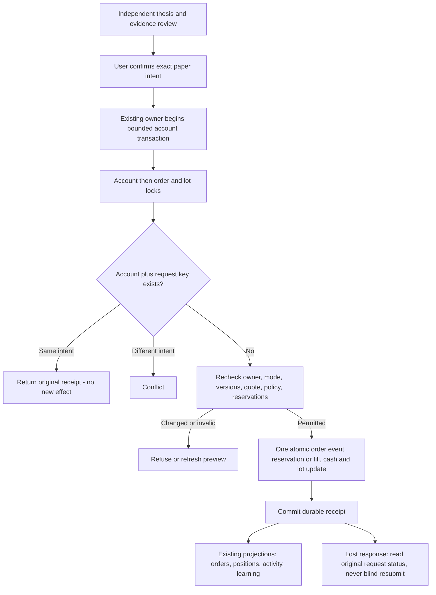

# Trading Lab v3: executable read-only preflight

Date: 2026-09-12. Current live Chairman request: make the product easier and more useful, build underlying mechanisms, and prepare a separate Macro research-to-production handoff.

Existing carrier: PR #566 / `sol/paper-cash-trading-suite-20260911`.
Operation: `paper-cash-trading-suite-20260911-sol-001`, v3 hardening.
Protected procedure pin: `57a2672af5b9dcea282e4bae01d1a0b9d10bb1cd`, Skillpack 1.0.1/bootstrap1. Current source work is confined to this research candidate, not production modules. Keep Draft/Hold.

## Capability delta

Before: architecture and scripted visual design only.
Now: a real typed Python preflight implementation, an actual FastAPI consumer and unit/API tests. The delivered companion package adds a redesigned four-view HTML interface, four backend schematics, a detailed integration contract, negative-control tests, visual QA and the expanded Macro handoff.

**BUILT_NOT_PROVEN / RESEARCH CANDIDATE / PRODUCTION_INERT.** This is not a working production paper broker. No account migration, reservation write, fill, order, provider call, score activation or deployment is implemented by this preflight. It cannot judge thesis truth or forecast success.

## What is in this Git source slice

- `backend/preflight.py`: strict plan and Decimal validation; typed server-owned account, quote, policy and review context; affordability and mark coverage; distinct thesis-review and economic-preview bindings; read-only expiry/revalidation.
- `backend/fixtures.py`: fixed synthetic state, including explicit model-not-connected and example-review cases.
- `backend/server.py`: bounded loopback ASGI harness; strict JSON and origin/host checks; `POST /api/preflight`; deliberately unsupported execution.
- `tests/test_preflight.py` and `tests/test_api.py`: the exact unit/API tests used in the candidate campaign.

The complete visual package is delivered as `Mastermind_Trading_Lab_V3_Implementation.zip` in the originating conversation. Its `web/index.html` is needed for the server's root UI route; this Git source slice does not claim that visual asset is committed here. Core/API tests are independent of that file. This explicit packaging boundary is not production wiring.

From this research directory, using the owning repository's compatible development environment:

```bash
python -m pytest tests/test_preflight.py tests/test_api.py -q
```

Candidate test environment: Python 3.13; FastAPI 0.128.2, uvicorn 0.48.0, httpx 0.28.1, pytest 9.0.2. These are observed local dependencies, not permission to change the repository lock or its supported floor. No full-repository CI, independent review or production acceptance is claimed.

## The user-facing simplification

Four destinations: Today, Plan, Portfolio, Learn. Today has one clear next action. Plan has three stages: independent view, evidence challenge, exact risk preview. Advanced market internals and methods remain available in context rather than becoming primary navigation.

No universal AI-approved score. Completeness, evidence support, market/playbook fit, affordability and outcome remain different facts. Missing data is visible. An unavailable model never becomes a completed review. The user can pass or wait; more trading and more screen time are not success metrics. Mobile and keyboard flows share the same logic.

## Two-speed mechanism, implemented

A slow **thesis/context binding** covers instrument, side, horizon, thesis, trigger, falsifier, counter-case, principal/account/mode, substantive evidence and market generations, and policy identity/version. Quantity, latest quote, cash and marks are excluded because this receipt is not an economic approval.

A fast **economic-preview binding** includes the complete plan and trusted context. Price, quantity, account version, reservations, marks, policy or review-state changes invalidate the old preview and trigger deterministic recalculation. A fresh quote must not require another expensive thesis review; a valid thesis must not approve a larger unaffordable trade.

The review producer must define material source generations; a new wrapper timestamp cannot manufacture an evidence change. Content digests are change detectors, not signatures or credentials. Even `verify_preview=True` grants no execution authority.

New-risk buys in deliberate-practice mode need the required completed review. Reductions bypass slow AI/thesis requirements but still require valid ownership/account/holdings/quote/session checks. Cancellation belongs to the future execution owner's independent risk-reduction path.

## Underlying target architecture, not yet implemented

1. Preserve `portfolio/self_directed.py` as the paper execution facade and account lineage.
2. Extend the existing Supabase/PostgreSQL estate for authenticated personal-paper state after a schema and writer audit. Do not create another holdings database or a permanent file/database dual writer.
3. Resolve user identity server-side; entitlement is not account ownership. Keep service credentials off the browser and prove tenant isolation at origin and database boundaries.
4. Reuse the actual user-facing Macro `engine/neuralweb/brain_gateway.py` and `config/brain.yml` for review purposes, budgets, tools and run status. The legacy `brain/mastermind_ai.py` portfolio loop is not a second personal coach.
5. Extend existing `trade_episodes`/`trade_memory.py` and existing thread/message owners; no new journal/vector memory/transcript plane. Existing privacy whitelists still apply.
6. Reuse Macro's public context generation; the Trading Lab browser does not recompute regimes, risk or tradeability.

### Proposed financial transaction



No model or human wait inside an account lock. A working market order needs an explicit max-spend/price-collar or deferred-match rule; do not fabricate a known maximum price. Cancel/fill races serialize through the same owner. Timeout is not proof of rollback. Database-confirmed rollback and unknown commit outcome are distinct.

Proposed domain entities: account, order, append-only order event, immutable fill, cash entry, lot/disposal, existing decision episode, thesis/review revision and rebuildable NAV/performance. Physical tables are conditional on the actual schema audit. Composite owner/mode references prevent cross-account joins. Each type owns different facts within one economic transaction, not independent mutable cash/share truth.

### Accounting and migration discriminator

Buy 100 at $100 and 100 at $200; sell 100 at $180; mark the remainder at $180. Total economic profit is $6,000. FIFO realised profit is $8,000 and remaining unrealised loss is $2,000. Mixing FIFO realised profit with an unchanged $150 average-cost position yields the wrong $11,000. This is a source-derived regression to reproduce against the legacy owner, not a production incident or a repair claimed by this candidate.

Validate old account/fills/pending/theses/NAV without economic drift before a one-writer cutover. Preserve original IDs and missing provenance. After new authoritative activity, rollback must reconcile that activity; pointing to stale legacy files is not rollback. Full settlement, corporate actions, richer matching and P&L remain explicit later capabilities.

## Proof actually obtained

- 120 unit/API tests passed on the local candidate.
- Six intentional mutations were caught by assertion failures: ignoring cash reservations; accepting expired quotes; trusting a review label without its content; reusing a preview after changed facts; allowing a real-mode account; granting execution authority.
- 37 artifact-level checks passed, including 24 view/theme/width combinations. Final run: zero page errors and zero network requests.
- Core Git blob `7bb95db31c69a851e8a23c5826c1ee31fb5941cc` is byte-identical to the tested local source; other published backend/test blobs require canonical readback alongside the publication receipt.

The browser-to-loopback attempt was blocked by administrator policy and was not bypassed. Visual QA used `set_content` with network denied; API tests independently exercised FastAPI through TestClient. These results do not establish a browser/network end-to-end journey.

An initial artifact QA run reused a document realm and hit a duplicate JavaScript const; the harness was corrected to create a fresh page and rerun. An older test requiring a full AI review on quantity changes was deliberately superseded: new tests require economics to refresh without unnecessary thesis review and still invalidate substantive argument changes. No unchanged red test is described as passed.

## Learning contract

Freeze the process assessment before outcome reveal. The illustrative exercise preserves that assessment when the displayed outcome changes. This is a UI boundary, not proof of personal skill or causality. Real learning uses first-known decision records, includes pass/wait decisions, separates fills from independent episodes, and reports uncertainty. Benchmark/factor residual is not automatically skill. No automatic model/policy self-promotion from profitable anecdotes.

## Separate Macro program

Direct study pin: Macro `1171b90bd29d895c3a397c51c453beb774ecd39e`. `market_state.py` heavily weights weekly/monthly information within its trend component; `quad_vector.py` publishes the causal current-quad owner and distinguishes historical transition objects; `dispersion.py` keeps its live gross clamp at 1.0 with candidate sizing multipliers shadow-only.

The separate handoff requires source/production archaeology, definitions and counterexamples, point-in-time preregistration, empirical adjudication, a real Macro producer-to-visible-consumer slice, and measured integration into Markov/regime, Neural Web, Prophet, Risk Radar, market/risk scores, Terminal and Trading Lab. Context, prediction, policy and execution are separate promotion levels. High dispersion is not an automatic risk-off rule.

Placement remains `WAITING_CAPACITY / needs_placement`. The Executive state read returned MCP 429, so no live receiver assignment is claimed. The handoff is an explicit current Chairman-requested responsibility, not an executable grant found in retrieved text. No approximate Agent OS parent is invented.

## Exact next action

Independent review plus authorized owner/schema/production audit, then a bounded integration wave replacing synthetic Context with authenticated owner reads and delivering one real user journey. Persistent execution and AI are not built by this candidate. Preserve the full-suite ambition, but do not widen this read-only source slice into a one-shot trading system or call a design merge shipped.
