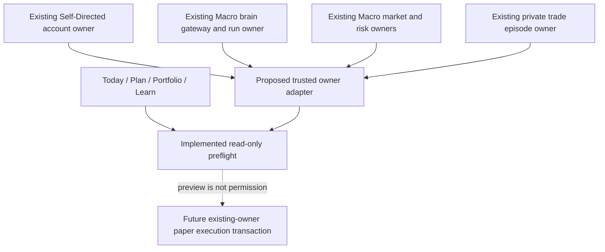
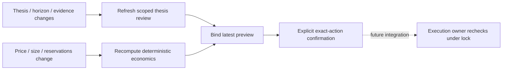
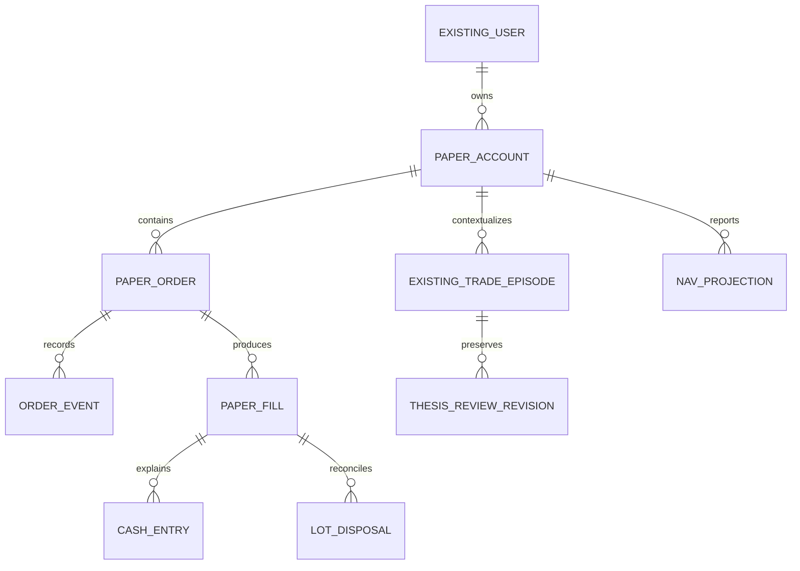
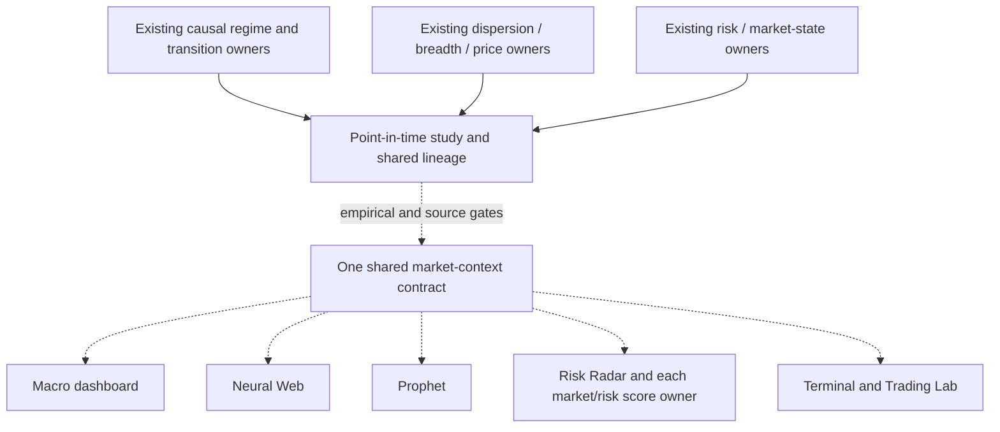

# Trading Lab v3 backend schematics

2026-09-12. Read-only preflight is implemented as a research candidate. Authentication, database transactions, persistent execution and new Macro integrations are proposed and not live. Exact DOT/SVG renderings accompany the conversation package.

## One owner per fact

User input supplies intent only. Account, quote, review, policy and source generations come from trusted owner reads. The synthetic adapter in the candidate is a fixture, not that production trust boundary.

## Two speeds

A current thesis review cannot approve an unaffordable quantity. A quote update must not require a new expensive thesis review. Content hashes are change detectors, never authorization credentials.

## Proposed domain structure

Physical extensions are conditional on actual schema/owner inspection. Composite account/mode references prevent cross-user joins. Unique account/request identity stops duplicate orders. Fills, cash and lot facts commit inside one economic transaction; positions, balances and NAV are projections. Existing trade episodes, conversations, identity and publication owners are not replaced.

## Separate Macro program

The conditional edges are not activated by this document. Descriptive context, forecast conditioning and policy effects have different proof gates. No circular independent-confirmation loop and no Trading Lab-local substitute model. See `MACRO_HANDOFF.md` for the multi-turn research-to-production sequence and consumer matrix.
